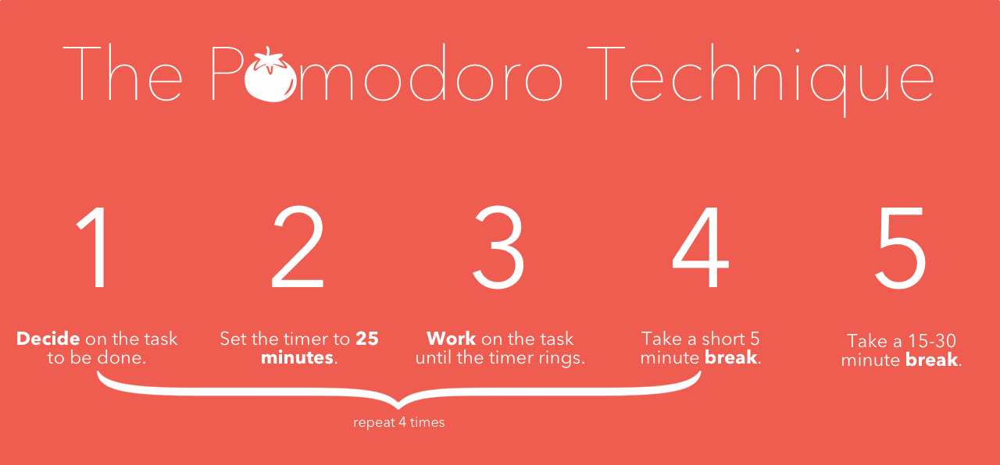

## Section 3: Project Management

#### Kanban

Kanban was developed by Toyota in the 1980's. The word comes from the Japanese for "sign" or "card".

From [Wikipedia](https://en.wikipedia.org/wiki/Kanban_(development)):

> Kanban is a method for managing knowledge work with an emphasis on just-in-time delivery while not overloading the team members. This approach presents all participants with a full view of the process from task definition to delivery to a customer. Team members pull work from a queue.

* Watch the first 2:15 of [this explanation of Kanban](https://www.youtube.com/watch?v=R8dYLbJiTUE)

Tasks:

* Create account on Trello
* Instructor creates a board for your project
* Instructor adds students to board
* Students create cards for the individual tasks of their project
  * do not be concerned with completeness at this point
* Assign cards and move the first cards into the working column

#### Communication

We will need a way to communicate when we're not in the same location. For this purpose we will use a group chat product called Slack.

Tasks:

* Instructor creates Slack channel for this project
* Instructor invites students to Slack as single-channel guest

#### Time Management

We suggest using the Pomodoro Technique in order to get the most out of your build time during this course.

Again, via [Wikipedia](https://en.wikipedia.org/wiki/Pomodoro_Technique):

> The Pomodoro Technique is a time management method developed by Francesco Cirillo in the late 1980s. The technique uses a timer to break down work into intervals, traditionally 25 minutes in length, separated by short breaks. These intervals are named pomodoros, the plural in English of the Italian word pomodoro (tomato), after the tomato-shaped kitchen timer that Cirillo used as a university student. The method is based on the idea that frequent breaks can improve mental agility.

A pomodoro cycle is 4 sessions of 25 minutes of work and 5 minute breaks, followed by a longer break (usually 15-30 minutes). Since our camp work sessions are generally 2 hours long, that allows for 4 pomodoros, or a single pomodoro cycle.

More information about pomodoro can be found on [pomodorotechnique.com](http://pomodorotechnique.com/).

Tasks:

* Find pomodoro app. There are [many](https://duckduckgo.com/?q=online+pomodoro+timer).

#### What else are we going to need?

Likely: a server. What else?

Tasks:

* Instructor faciliates spinning up a group server
* Everything else!

### Congratulations, you're on to the build phase! 
