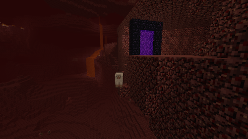

<!--BREAK-->

# Section 5: Adventure Maps and Nether Portals

## Adventure Maps

> Adventure mode is a game mode intended for player-created maps by limiting some of the gameplay in Minecraft, in which the player cannot directly destroy most blocks to avoid spoiling adventure maps or griefing servers. Most blocks cannot be destroyed without the proper tools. However, players can still interact with mobs and craft items. [link](http://minecraft.gamepedia.com/Adventure)

Notch, in 2010:

> "But why", some people ask, "are you making Minecraft programmable?". The reason is, adventure mode!

> I foresee a future where people can design “challenge maps” in creative or survival mode, then share them with people so that they can try to beat them in Adventure mode. Being able to create interesting puzzles or trigger events requires some more advanced programming than the sand and water based stuff we’ve seen so far, yet still I don’t want to introduce real programming into the world. [link](http://notch.tumblr.com/post/779956568/the-rationale-for-redstone)

This section's activities involve mostly just playing adventure maps. But as you play, solving the puzzles of the maps, consider how you might have built them differently, what's fun and challenging about them or what's simply tedious and boring.

The first map is relatively easy and can be played through in one sitting. It's called "D&D's Adventure Map" and was built for twin daughters, Delaney and Delilah. As a single player playing the map, you can snag both of their starting items, although you probably won't need them all (or maybe you should leave some should you perish and respawn).

> The concept of the map is to find the diamonds hidden in the world in various locations and to obtain extra diamonds by defeating "boss dungeons" and solving the riddles in every dungeon. You "level up" as you play by obtaining better gear which allows you to do the harder dungeons. [link](http://www.minecraftforum.net/topic/1775721-childrens-adventure-map/)

* Play "D&D's Adventure Map"

After you're done with "D&D's" map, try one of the other maps provided. If you don't like the first one you pick, choose a different one. They vary in plot, types of challenges, difficulty, etc.

Maps provided:

* "Teramia 0.9.1 Beta" is an open-ended map with no clear path or plot. By changing the dynamics of vanilla Minecraft only slightly, the map can still change what skills and problem-solving strategies are of most value.
* "The Evil Doctor's Castle" is a classic escape-style map. Quickly determining the way through each "level" is of the most importance with this map, but it does have a very clear path to success!
* "Jungle Stream" is a classic story/puzzle/parkour map in the style of the Indiana Jones series.*

## Nether Portal

The Nether is an awful place without much to see and a lot to be afraid of, but it also a place one must visit if one is ever to create potions. It is also fairly handy when traveling long distances.

This section is going to focus on placing nether portals for maximum transportation value with maximum safety features.

Going through a nether portal will create a linked portal in the nether. If there is already an active portal within range (about 128 blocks) in the other world, the portal will link to it.

For this exercise, we will create two portals to travel between two mountain ranges.

Some friendly reminders regarding traveling through the nether:

* Take flint and steel. Your portal might be damaged by ghasts. In this exercise, you'll need it to light a new portal at the 2nd location.
* Take cobble and gravel. The former for building walls to protect from ghasts, the latter for gravel elevators.
* Take a bow and plenty of arrows for fighting ghasts.
* Do not hit zombie pigmen! Be careful when mining around them!
* Use shift/sneak liberally while near precipices and lava, so as not to fall

The advantage of using the nether for long-distance travel is that for every block traveled in the nether, you travel eight blocks in the overworld. Since naturally occurring resources are often far apart in the overworld, you will very likely need to travel long distances with some frequency as you collect and transport those resources.

Placing portals so that they connect is tricky. From the wiki:

> Horizontal coordinates and distances in the Nether are proportional to the Overworld in a 1:8 ratio (1:3 in Xbox 360 & PlayStation 3 version)...This does not apply on the Y-axis...Thus, for a given location X, Y, Z in the Overworld, the corresponding coordinates in the Nether are X ÷ 8, Y, Z ÷ 8. Conversely, for a location X, Y, Z in the Nether, the matching Overworld coordinates are X × 8, Y, Z × 8.

The goal of this exercise is to travel through the nether to another portal to the overworld position 1000 blocks away.

Mobs of all kinds can make their way through portals, so be a little cautious when traveling through no matter which direction. Here an unfortunate sheep has found their way into the nether and a very precarious position. He doesn't look too happy:

