# Command Blocks

> A command block is a redstone component that can execute commands when activated. It cannot be obtained legitimately in survival mode, and is primarily used on multiplayer servers and in custom maps.

## Practicing the basic commands available to command blocks

Create a new creative world.

To obtain a command block type the command `/give <playername> command_block`.

Place the command block and right-click it. Now enter the `/give` command into the command block. This will give the nearest player an iron pickaxe, for example:

`/give @p iron_pickaxe`

Click "done" and then put a button on the command block by holding the button and shift clicking on the command block. (A command block executes commands when activated by redstone power.) Then activate the command block by right-clicking the button. You'll receive an iron pickaxe.

## Command block reference

Some of the other more useful commands for use in command blocks are:

* `say`, `tell`, `msg` and `w` (whisper) to communicate messages to a player(s).
  `tell <player> <message>`
* `clear <player> [item] [data] [maxCount] [dataTag]` clears a players inventory, or just the items specified in the arguments
* `effect <player> <effect> [seconds] [amplifier] [hideParticles]` gives the targeted player or entity the specified effect for the specified time (default is 30 seconds). There is also `effect <player> clear`
* `gamemode <mode> [player]`
* `playsound <sound> <player> [x] [y] [z] [volume] [pitch] [minimumVolume]`
* `setblock <x> <y> <z> <TileName> [dataValue]`
* `summon <EntityName> [x] [y] [z]`
* `testfor <player> [dataTag]`
* `time set <value>`
* `toggledownfall`
* `tp [target player] <destination player>` or `tp [target player] <x> <y> <z>`
* `weather <clear|rain|thunder> [duration in seconds]`
* `xp <amount> [player]`

## Communicating to a player with command blocks

This exercise is going to use command blocks to warn a player of impending doom.

There are a few different types of command blocks:

* a command block ("Impulse") will try to execute its command once
* a chain command block ("Chain") will not try to execute its command until another command block facing it executes its own command
* a repeating command block ("Repeat") will try to execute its command every game tick until no longer activated

The first block uses a `testfor` command which then powers a `say` block when a player enters a specific radius:

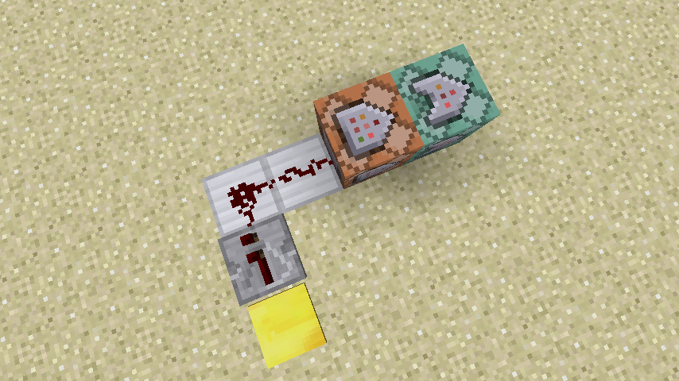

## Moving a player around a map with command blocks

Let's take a look at how to build a simple security system for your house, using a command block and a pressure plate.

* First, place a pressure plate in front of your door.
* Make sure that the player will step on it when walking to the door.
* Now, place a command block under the pressure plate somewhere so that it will be powered when the plate is stepped on.

* Now go to the command block and enter `/tp @p[r=<radius>,name=!<yourname>] <x> <y> <z>`

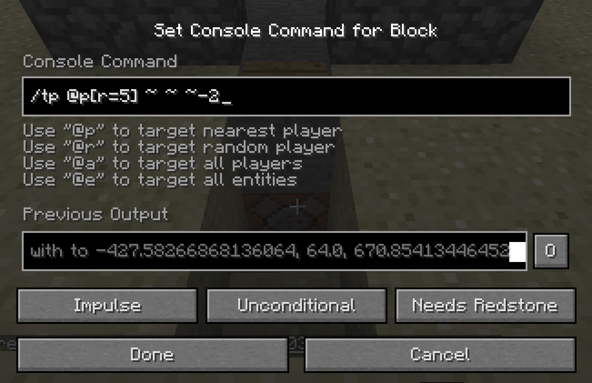

Breaking this command down we have `/tp`, which is the command for teleporting players. Then we have the `@p` specifier, which says that this command block acts on players. The `@p` command takes arguments, `r=` for radius and `name=` for which players to teleport. Setting the radius is straightforward. Setting the name, however is a little interesting. Here, we use the `!` operation, which means `NOT`. Just like in redstone, this inverts the output of a command. Right now, we're using it to make sure any player that is `NOT` you gets teleported, while you remain safe. The final part of the command is the location to teleport to, which you put in place of the `<x> <y> <z>` in the command. This could be `~ ~ ~-2` to move the player back 2 blocks.

Here is a setup with a redstone circuit, so no pressure plate required!

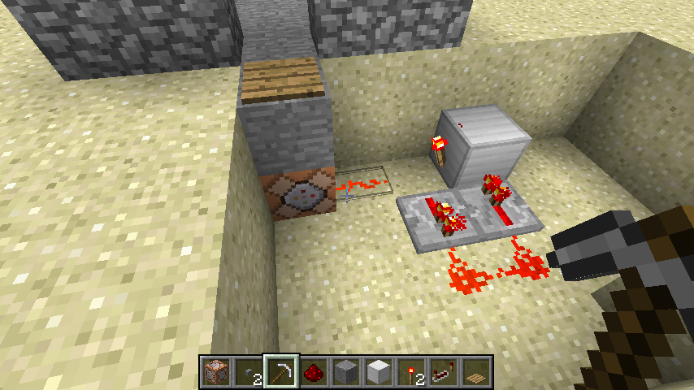

Here is the final command that makes sure one user can get past:

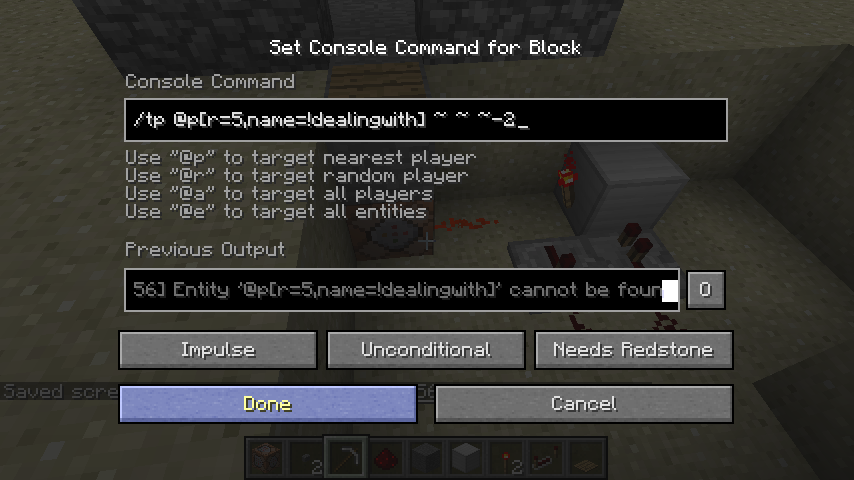

## Giving a player items with command blocks

The `/give` command is one of the more versatile commands available for use in Command Blocks. In this section, we'll list a few good uses.

# Command Block "Spawner"

In this section we will use two command blocks, creating a custom mob spawner whenever a player enters a certain distance from the contraption.

It is very similar to the other command circuits we already built, except instead of simply using `/say` or teleporting all nearby players, this one will conditionally spawn zombies when players are nearby.

The first step is to create a simple clock circuit to power the command block that will detect when a player is within a certain radius.

The first command block uses the `testfor` command to test for any player within _N_ blocks. It is a normal command block with the default settings just like those we used before.

The next command block will have two special properties. The first is it will be a _chain_ type command block. It will not execute unless the `testfor` block executes. The second special property is that it will be a _conditional_ command block. A command block in conditional mode will only execute its command after the command block behind it has executed successfully. So now this block will not execute unless the `testfor` block executes successfully (it finds a player within its defined radius).

This `/summon` command will generate Zombies named "Braaaaains" wearing leather caps (so they won't burn up during daytime).

`/summon minecraft:zombie ~ ~1 ~ {CustomName:Braaaaains,CustomNameVisible:1,ArmorItems:[{},{},{},{id:"minecraft:leather_helmet",Count:1}]}`

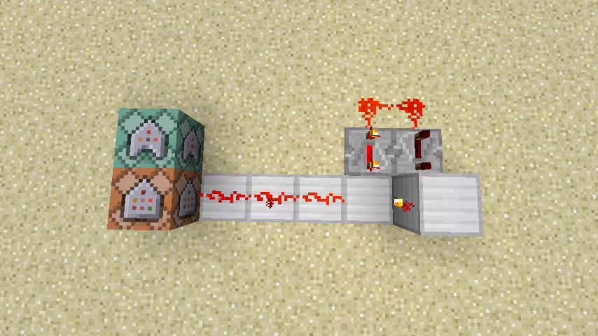

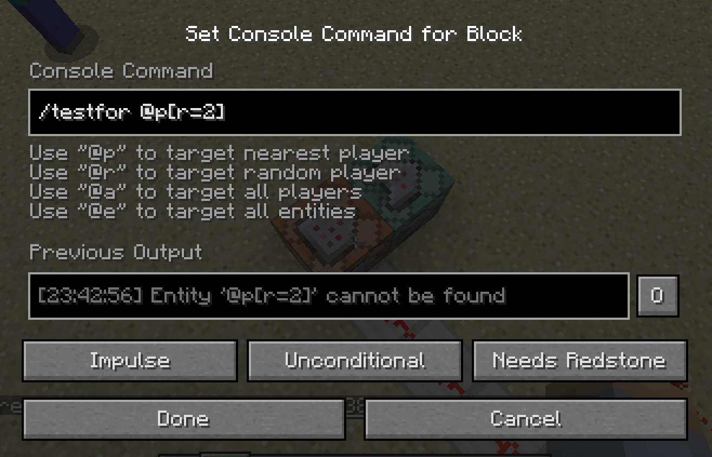

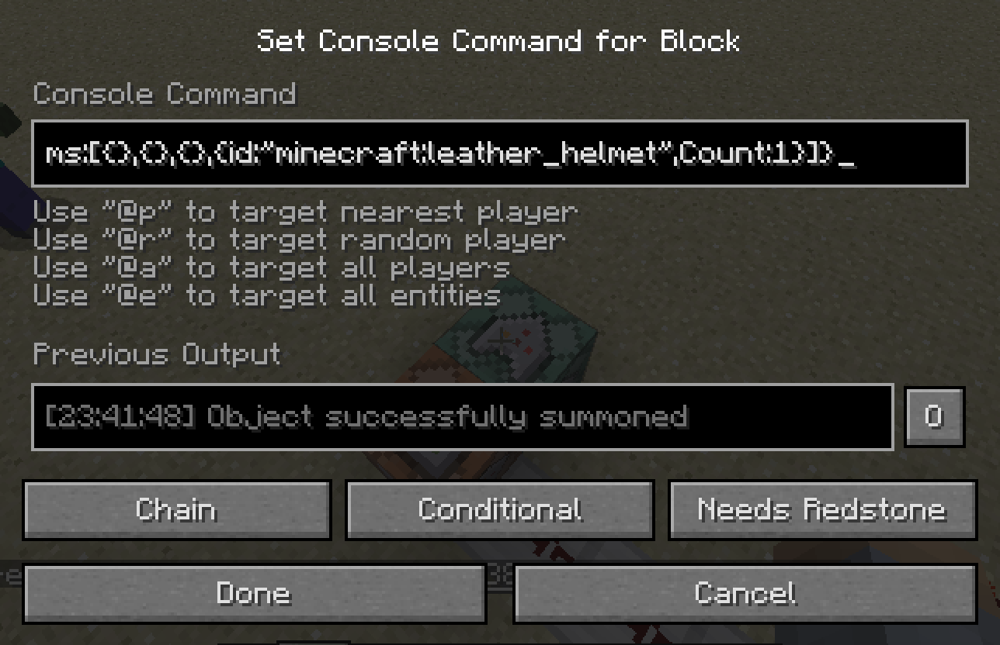

## Spawner Upgrades Challenge

Once you have a working spawner, try to figure out these upgrades:

1. Spawn more than one mob at a time, in different areas around the spawner.
1. Add a switch to turn on and off the spawner, by making the first clock circuit a switchable loop.

# Automatic Bridge

In this section we are going to build a small prototype of an automatic one-way bridge.

The construction consists of four command blocks to create the bridge and four command blocks to return those blocks to air once you've crossed. We'll use the `setblock` command with relative positions, so the following examples rely on putting your command blocks in exactly the same relative position compared to the bridge. You don't have to do that, though--you can simply adjust the relative coordinates based on the placement of your command blocks.

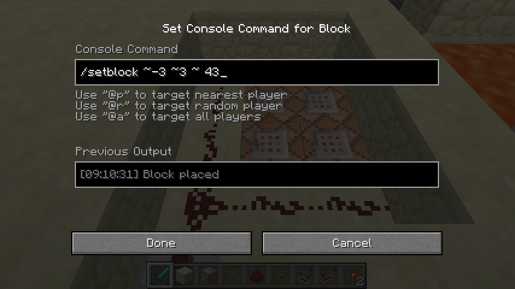

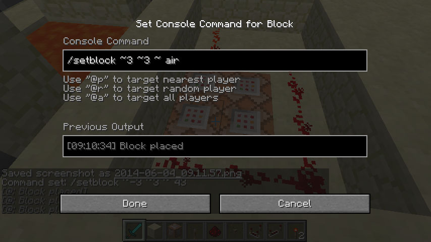

You can test your command blocks by placing a button on them (shift-click to place a button on a command block). Once you have the `setblock` commands all set and working correctly, connect your command blocks to pressure plates via redstone dust, as shown in the first screenshot above. Now hide your command blocks and redstone!

## Make it better

The above build is more of a proof-of-concept. It's pretty easy to see that the pressure plates cause the bridge action, and it's not much of a deterrent, besides. One improvement we could make would be to use a detector block to determine when a player approaches from one side and place the bridge blocks or air appropriately. Use the techniques from our "spawner" contraption to create a clock powering a `testfor` command block.

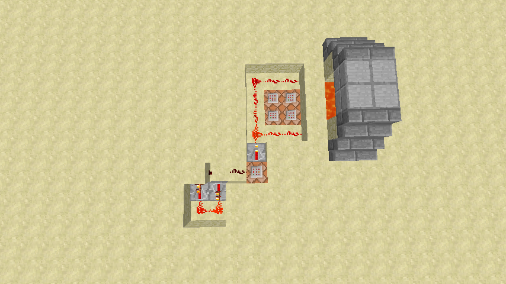

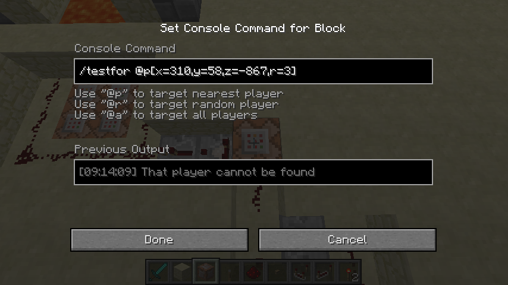

Now make the `testfor` command only test for your player. You could even make it a trap bridge, only letting you cross and turning the blocks to air when any other player tries to cross.

## References

* [minecraftcommand.science](https://minecraftcommand.science/) -- "Several minecraft vanilla JSON generators for all your `/give` and `/summon` needs."
* Minecraft mobspawner and summon generator: [http://minecraft.tools/en/spawn.php](http://minecraft.tools/en/spawn.php)
* Minecraft wiki command reference: [http://minecraft.gamepedia.com/Commands](http://minecraft.gamepedia.com/Commands)
