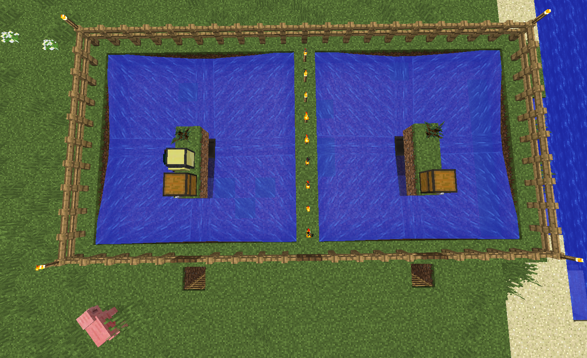

## Efficient Tree Farming

We learned in Section 3 how to get turtles to chop down trees for us. But we can set up an efficient tree farm that outputs twice as much wood, refuels efficiently and collects saplings.

The setup for our tree farm is so:

* 2 9x9, 1 block deep holes
* flowing water in each corner--this leaves one dry bock in the middle
* a tunnel below leading to the center block
* a hopper in the center block, into a chest below, to collect saplings
* one dirt block floating 1 block above the hopper block for the tree
* a turtle facing the sapling/tree
* a chest behind the turtle for collecting logs



```lua
-- tree farmer
-- put fuel in first slot
-- put 1 block of wood type in second slot
-- put saplings of wood type in third slot
 
function fuel()
  if turtle.getFuelLevel() < 30 then
    turtle.select(1)
    if turtle.refuel(1) then
      return true
    end
    print("Refuelling failed.")
    return false
  end
end
 
function chop ()
  local blocksMovedUp = 0
  while turtle.detect() do
    fuel()
    turtle.dig()
    if turtle.detectUp() then
      turtle.digUp()
    end
    turtle.up()
    blocksMovedUp = blocksMovedUp + 1
  end
  while blocksMovedUp > 0 do
    fuel()
    turtle.down()
    blocksMovedUp = blocksMovedUp - 1
  end
  -- plant new tree
  turtle.select(3)
  turtle.place()
  return true
end
 
function detectTree()
  turtle.select(2)
  if turtle.compare() then
    return true
  else
    return false
  end
end
 
function farmTree()
    tries = 0
    while not detectTree() do
      print("Tried " .. tries .. ". No tree. Waiting a minute")
      os.sleep(60)
      tries = tries + 1
    end
    chop()
    right()
    right()
    for i=4,16,1 do
      turtle.select(i)
      turtle.drop()
    end
    right()
    right()
    -- if there are no more saplings
    if turtle.getItemCount(3) == 0 then
      print("Out of samplings")
      return false
    end
    return true
end

function right()
  turtle.turnRight()
end

function left()
  turtle.turnLeft()
end

function fif(val, a, b)
  if val then a() else b() end
end

function fif_flip(val, b, b)
  if val then a() else b() end
  return not val
end

local args = {...}
if #args > 1 or type(args[1]) ~= "string" then
  print("Takes argument: <right/left>")
  return
end

ret = true
left_tree = args[1] == "left"
while ret == true do
  ret = farmTree()
  fif(left_tree, right, left)
  for i=1,10,1 do
    turtle.forward()
  end
  fif(left_tree, left, right)
  left_tree = not left_tree
end
```

This program takes one argument--if it is starting on the left or right side of the farm. This way the program keeps track of which side of the farm it is on and alternates appropriately. It does this using the `fif` function. `fif` stands for _functional-if_. It takes a _boolean_ value and calls one of two functions depending on its value. This is called a `ternary operation` ([en.wikipedia.org/wiki/Ternary_operation](https://en.wikipedia.org/wiki/Ternary_operation)). The Lua programming language that we use to program turtles in ComputerCraft lacks a _ternary operator_, so we use the _functional-if_ syntax instead. (See [lua-users.org/wiki/TernaryOperator](http://lua-users.org/wiki/TernaryOperator).)

There are significant improvements that could be made to this design. Try any of these:

* Use bone meal, while supplies last, to grow the tree
* Move the dump chest so it is more accessible (the turtle will need to come to it)
* Use another turtle to harvest the saplings, placing them in another chest for the farmer turtle to use
* Use the logs from the tree harvest to create charcoal, which the farm turtles can then use for fuel
