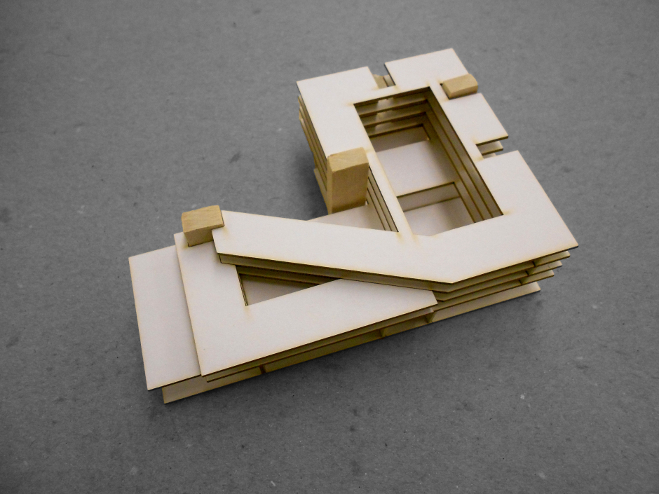

## Section 2: Design

### Part 1

#### Research

##### What is already out there?

* List our favorite mods
  * [List of mods](http://modlist.mcf.li/)
* List our favorite maps
* List our favorite stories
* List our favorite [______]

#### Ideation

##### What do we want to build?

* What is our goal?
* What are we capable of accomplishing in our time frame?
* What elements do we like from our list of favorites?

#### User Stories

##### Who are we building for? 
  
* Ourselves?
* Our friends?
* Our family?
* Customers?
* Other gamers?

How are these people different?

##### For each role we are building for, consider:

* How familiar are they with Minecraft?
* How often to they play Minecraft?
* Where are they when they play Minecraft?
* Why do they play Minecraft?

##### Then let us ask ourselves:

* How do our users experience Minecraft differently?
* How will this impact the design of our product?

#### Prototyping

##### What is prototyping?

##### What constitutes rapid prototyping?

Prototyping quickly allows for an accelerated feedback cycle. We'll talk more about iterating on these prototypes later.

##### Paper prototyping

From [Wikipedia](https://en.wikipedia.org/wiki/Paper_prototyping):

> In human–computer interaction, paper prototyping is a widely used method in the user-centered design process, a process that helps developers to create software that meets the user's expectations and needs—in this case, especially for designing and testing user interfaces. It is throwaway prototyping and involves creating rough, even hand-sketched, drawings of an interface to use as prototypes, or models, of a design. While paper prototyping seems simple, this method of usability testing can provide a great deal of useful feedback which will result in the design of better products. This is supported by many usability professionals.

[This Design Sprint Tuesday video talks about what these sketches look like in the end](https://www.youtube.com/watch?v=_ITJ5lAXQhg).

Now let's get to putting some of our ideas down on paper. What will some of the aspects of our project look like to an end user? How will they experience it? What will some of the redstone contraptions work?

---

<!--BREAK-->

## Homework:

##### Continue working on your paper prototypes

* What aspects of your prototypes do you like the most?
* Which concepts seem like they could be accomplished in 2 weeks?
* What is not working, or seems too difficult to implement?
* Be prepared to come in tomorrow ready to make a decision on what direction to take.

## Extra credit

* Check out [this video on using paper prototypes to design Android applications](https://www.youtube.com/watch?v=07xPF7L6klY)
* Check out [this video about a high-definition prototype for a podcast app developed by Google Ventures](https://www.youtube.com/watch?v=iqGLrMjBLZ4)

<!--BREAK-->

### Part 2

#### Determining Direction

[This Design Sprint Wednesday video talks about how to make a decision on which direction to take with your project](https://www.youtube.com/watch?v=7BKBFOOKbNo0).

Before moving forward ask yourselves these questions in order to properly determine the scope of your project:

* How can we trim off extra, unnecessary details?
* What is the core of our concept?
* Who is responsible for which aspects of our product?
* What is the order of events?
  * What do we need to build first?
  * What comes after that... etc.

#### Iterating

Our goal is to get feedback as quickly as possible, so we can iterate on our concept.

* When is our product ready to share with others?
* Who can we share it with?
* How do we know if our product is complete?

While we build our product, we will learn that some details could be improved. It is best to learn this as quickly as possible. When our product is ready, we should share it with others and get feedback:

* What feedback did we get?
* Did they like the product?
* Did they find it confusing?

---

Images from Google Istanbul and [learning ecologies](https://learningecologies2013.wordpress.com/2013/01/26/school-design-iterations/).

