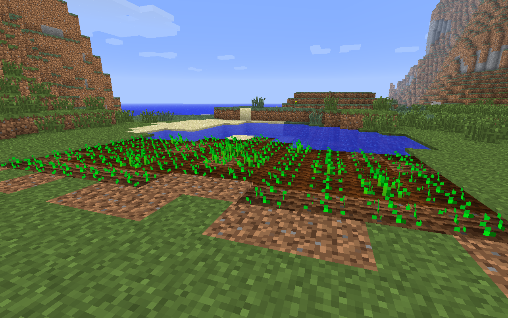
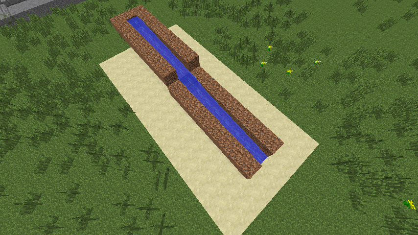
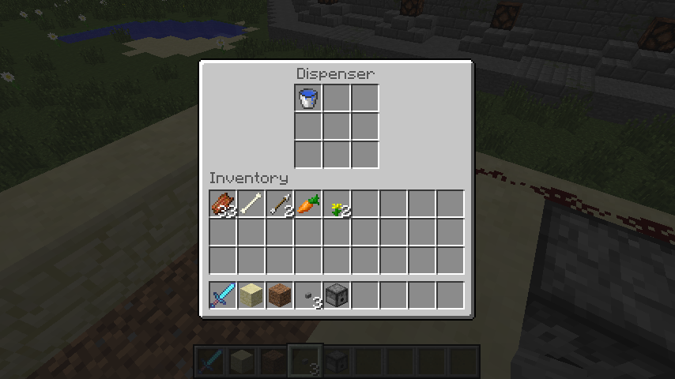
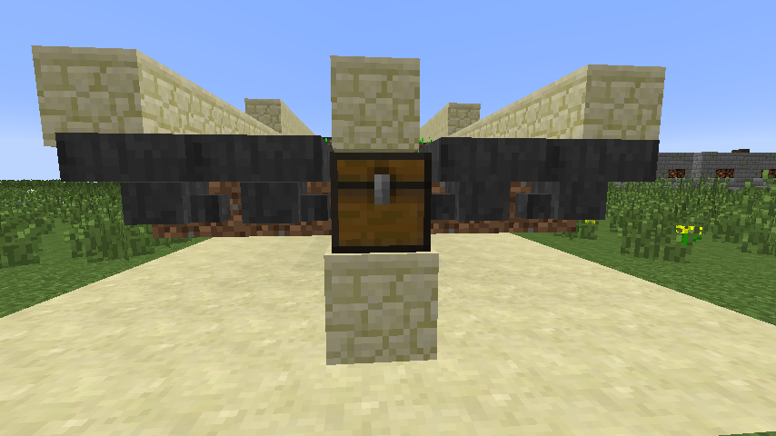
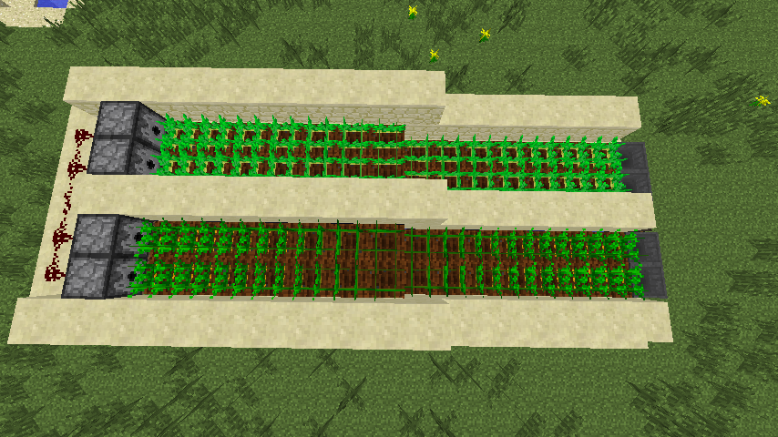
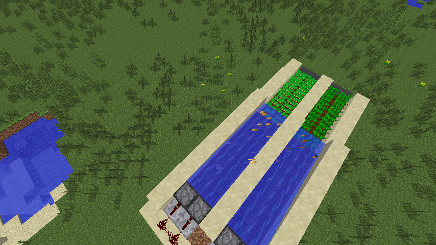
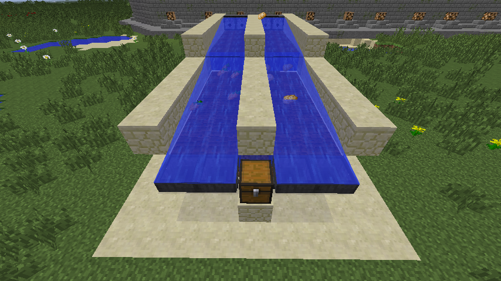
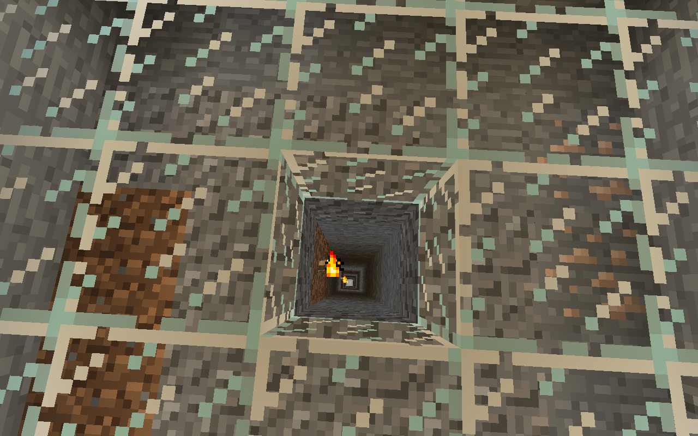

# Section 2: Advanced Survival Strategies

### Farming

A Minecraft survivor needs to quickly develop a renewable food source.

> This section is going to keep you happy and healthy throughout your Minecrafting days

The easiest source of food is getting meat from animals such as cows, pigs, and chickens. Their meat can be eaten raw or cooked; raw food has a chance of making you sick, while cooked food fills you up more. Animals, however, aren't a renewable source (at least until you can get a breeding program started). On the other hand, wheat is an easily obtainable and fast-renewing source of food. It only requires seeds, a source of water, and a hoe.

First, you need to acquire some seeds. They are dropped when long grass is destroyed. Try to start out with at least 10 seeds to get a good-sized farm going.

Use the hoe to turn some ordinary dirt blocks into farmland. Farmland needs to be hydrated by nearby water in order to remain farmland; farmland that dries out will convert back to dirt. Take a look at the screenshot below to see how farm away water will hydrate farmland.

One block of water can hydrate up to 4 blocks away in all directions. Even though I plowed more than that in the picture below, the water can only hydrate the farm land up to 4 blocks away, so some of the plowed land becomes dirt, and grass.

Plant your seeds by using them on the farmland. As long as they have a lightsource (the sun, torches, or other blocks) these seeds will slowly grow into wheat (the picture below has wheat in several stages of growth). The wheat will turn a yellow color when it is finished growing.

Harvest the fully-grown wheat which will also drop seeds for future crops. On average, each wheat block will drop 1.5 seeds so your crop size will grow faster and faster over time.

Make bread using the recipe below. Bread fills you up almost as much as cooked meat but is much more sustainable and faster to harvest.

### Automatic Farming

Farming isn't exactly difficult, and can be quite relaxing, but if you wanted to speed things up a bit there is a simple redstone contraption you can construct to automatically harvest your crops.

Water will flow 8 blocks, which is an important fact to know for many purposes. This farm will use water flowing downhill over the crops to automatically harvest them and drop them into hoppers, and then a central chest where you can pick up the foodstuffs.

Create a new creative world for this exercise.

First we'll set up the irrigation system for our farm by creating a canal down the center of our farming area. Both levels are eight blocks long, but the water starts at the second block so that it will flow off the end of the first level and down the second level.

Next cover the irrigation canal (using whatever block you want) and create the farm plots next to the canal:

Now create walls along the side of your plots. These will keep the water from flowing over the sides.

Now we'll place dispensers along the top of our farm. These will dispense the water that will harvest our crops and carry them down to the bottom of the farm.

To power the dispensers, you'll need redstone repeaters, redstone and a button, like so:

Place a bucket of water in each dispenser. The nice thing about this setup is the water buckets will remain full even after the dispenser dispenses the water.

Plant crops of your choice. Here we've planted some carrots on the left and potatoes on the right:

Now we need to get the collection system in place. Place a chest at the bottom-center of your farm, directly in front of where the irrigation canal stops. Then place hoppers on either side of the chest. To do so take a hopper and then shift-click on the side of the chest to place the hopper. Do the same on the side of the hopper with another hopper. Now everything falling into these four hoppers will go into the chest in the center:

Now we have to wait for our crops to grow. Go ahead and take some bonemeal in your hand and right-click on your crops until they're fully grown.

To harvest, go press the button connected to the hoppers. The water will flow down over your crops, harvesting them and carrying them down to the hoppers.

When all the items have flowed down into the hoppers, press the button to stop the water flow, and replant!

### Mining strategies

In Minecraft, ores tend to group together at certain heights and some ores will only occur very far underground. Diamond ore, for example, only spawns at a Y-coordinate of 15 or below. To search for diamonds and other ores most efficiently, we need to mine below that level.

Dig an initial shaft straight down until you hit level 13 (you can check this by pressing F3 to open up the console). We will be mining out levels 13, 14, and 15 so we can find diamond as easily as possible.

Create an open work area where you can have chests, furnaces, and lighting. This will serve as your underground base for storing supplies and mined ore. Our mine shafts will branch off of this central area.

Whenever we mine a straight shaft, we are either digging out or looking at 3 columns of blocks. The column we are digging and then the ones to the left and right. To mine most efficiently, we should locate our shafts every 3 blocks. We can reach the highest number of blocks with the fewest number of shafts. Torches should be placed every 7 blocks alongside our shaft. Any further apart, and mobs may spawn in the middle. Any closer, and we would be using more torches than needed. Try to keep all of your torches on one side. If you get lost, you'll know which direction you're traveling.

If you keep mining long enough, you're sure to find some good veins of ore! Here, I found a vein of diamond ore after just a few minutes of mining from start to finish.

### Nether Portal

The Nether is an awful place without much to see and a lot to be afraid of; but it also a place one must visit if one is ever to create potions and it is fairly handy when travelling long distances.

This section is going to focus on placing nether portals for maximum transportation value with maximum safety features.

Going through a nether portal will create a linked portal in the nether. If there is already an active portal within range (about 128 blocks) in the other world, the portal will link to it.

For this exercise we will create two portals to travel between two mountain ranges.

Some friendly reminders regarding traveling through the nether:

* Take flint and steel. Your portal might be damaged by ghasts. In this exercise you'll need it to light a new portal at the 2nd location.

* Take cobble and gravel. The former for building walls to protect from ghasts, the latter for gravel elevators.

* Take a bow and plenty of arrows for fighting ghasts.

* Do not hit zombie pigmen! Be careful when mining around them!

* Use shift/sneak liberally while near precipices and lava, so as not to fall

The advantage of using the nether for long-distance travel is that for every block traveled in the nether, you travel eight blocks in the overworld. Since naturally occuring resources are often far apart in the overworld, you will very likely need to travel long distances with some frequency as you collect and transport those resources.

Placing portals so that they connect is tricky. From the wiki:

> Horizontal coordinates and distances in the Nether are proportional to the Overworld in a 1:8 ratio (1:3 in Xbox 360 & PlayStation 3 version)...This does not apply on the Y-axis...Thus, for a given location X, Y, Z in the Overworld, the corresponding coordinates in the Nether are X ÷ 8, Y, Z ÷ 8. Conversely, for a location X, Y, Z in the Nether, the matching Overworld coordinates are X × 8, Y, Z × 8.

The goal of this exercise is to travel through the nether to another portal to the overworld position 1000 blocks away.

Mobs of all kinds can make their way through portals, so be a little cautious when traveling through no matter which direction. Here an unfortunate sheep has found their way into the nether and a very precarious position. He doesn't look too happy:

### Mob Farm/Grinder

Occasionally you will find a monster spawner in a Minecraft dungeon. These cage-like blocks spawn monsters in a cube around them every few seconds. While they can be dangerous, they can also be a valuable source of items and experience. To do so safely and quickly, you can build a structure that serves two purposes. First, it should weaken the monsters using water, lava, or a steep fall so that you can defeat them faster. Second, it should also allow you to attack the spawned monsters from a safe place.

You must locate a monster spawner! They're locating in dungeons and are surrounded by stone brick rather than smooth stone. When you find it, dig out a large space around the spawner (about 8x8) and put torches around it so monsters won't spawn.

The goal for this mob grinder is to drop zombies exactly 22 steps (check out the Minecraft wiki to calculate how high you should drop each type of monster). After the drop, they will have low enough health that one hit from a sword will kill them. At the same time, the player must be able to stand near enough the spawner that new zombies will spawn. First, we need to force the monsters into one location so we can control where they go. Dig out some of the stone on one side (see the picture for reference) and then put water at the middle and corners of the other side (underneath the glowstone in the second picture).

Next, we will dig a shaft upward 22 blocks (we built ours out of glass so you can easily see how it is built). Inside, we will use a water-and-sign checkerboard to get the zombies to swim up to the top. The air pockets will keep the zombies alive while they swim upward.

Third, we need to build a horizontal tunnel with water at one end to push the zombies to the top of our drop shaft. Place one more water source next to the top sign so that it pushes the zombies over the spawner to the opposite side. Another sign at the end will stop the water where we want it for the drop shaft.

And finally we create a 22-block high shaft for the zombies to drop down. We can dig stairs down to the bottom and easily farm these zombies for items and experience. By standing one further down than the zombies, we can attack their legs while being completely safe.

We've given you a world that has a zombie dungeon located directly below the spawn point. Your task is to find the spawner (dig down carefully to find it) and build a mob grinder like the one described above.
