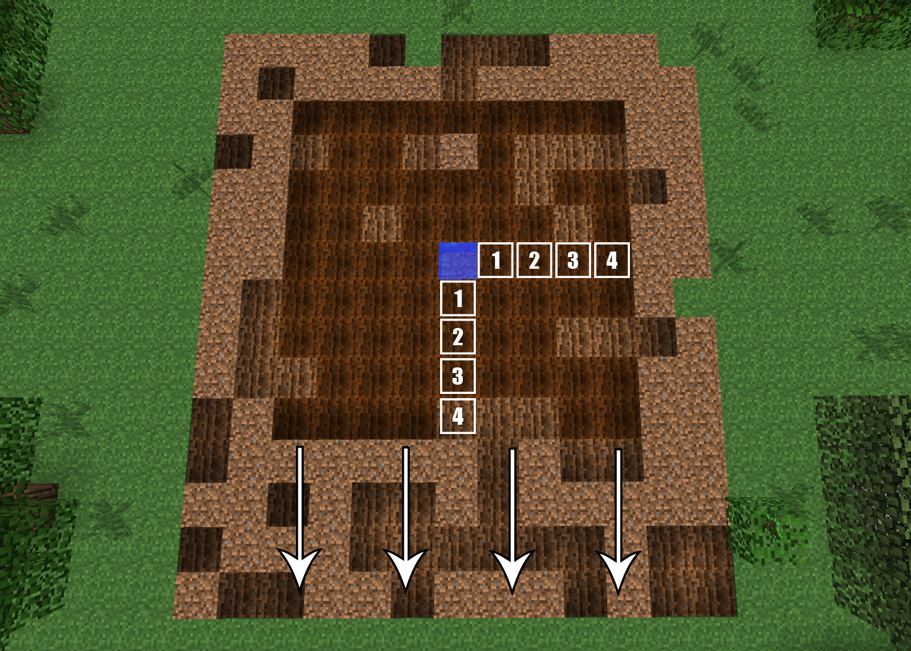
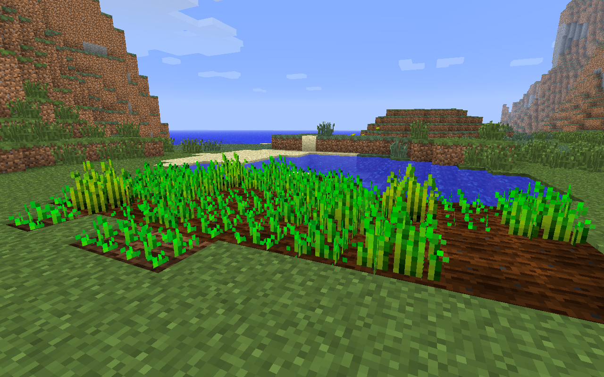
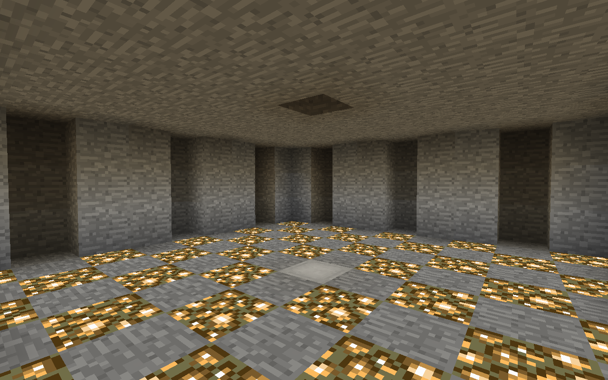

# Section 2: Advanced Survival Strategies

## Farming

A Minecraft survivor needs to quickly develop a renewable food source.

> This section is going to keep you happy and healthy throughout your Minecrafting days

The easiest source of food is getting meat from animals such as cows, pigs, and chickens. Their meat can be eaten raw or cooked; raw food has a chance of making you sick, while cooked food fills you up more. Animals, however, aren't a renewable source (at least until you can get a breeding program started). On the other hand, wheat is an easily obtainable and fast-renewing source of food. It only requires seeds, a source of water, and a hoe.

First, you need to acquire some seeds. They are dropped when long grass is destroyed. Try to start out with at least 10 seeds to get a good-sized farm going.

Use the hoe to turn some ordinary dirt blocks into farmland. Farmland needs to be hydrated by nearby water in order to remain farmland; farmland that dries out will convert back to dirt. Take a look at the screenshot below to see how farm away water will hydrate farmland.

One block of water can hydrate up to 4 blocks away in all directions. Even though I plowed more than that in the picture below, the water can only hydrate the farm land up to 4 blocks away, so some of the plowed land becomes normal dirt and grass. 

Plant your seeds by using them on the farmland. As long as they have a lightsource (the sun, torches, or other blocks) these seeds will slowly grow into wheat (the picture below has wheat in several stages of growth). The wheat will turn a yellow color when it is finished growing.

Harvest the fully-grown wheat, which will give you wheat as well as seeds for future crops. On average, each wheat block will drop 1.5 seeds so your crop size will grow faster and faster over time. Make bread using the recipe below. Bread fills you up almost as much as cooked meat but is much more sustainable and faster to harvest.

## Mining strategies

In Minecraft, ores tend to group together at certain heights and some ores will only occur very far underground. Diamond ore, for example, only spawns at a Y-coordinate of 15 or below. To search for diamonds and other ores most efficiently, we need to mine below that level.

Dig an initial shaft straight down until you hit level 13 (you can check this by pressing F3 to open up the console). We will be mining out levels 13, 14, and 15 so we can find diamond as easily as possible.

Create an open work area where you can have chests, furnaces, and lighting. This will serve as your underground base for storing supplies and mined ore. Our mine shafts will branch off of this central area.

Whenever we mine a straight shaft, we are either digging out or looking at 3 columns of blocks. The column we are digging and then the ones to the left and right. To mine most efficiently, we should locate our shafts every 3 blocks. This lets us see the highest number of blocks with the fewest number of shafts. Torches should be placed every 7 blocks alongside our shaft. Any further apart, and mobs may spawn in the middle. Any closer, and we would be using more torches than needed. Try to keep all of your torches on one side. If you get lost, the torches will let you know which direction you dug in.

If you keep mining long enough, you're sure to find some good veins of ore! Here, I found a vein of diamond ore after just a few minutes of mining from start to finish.

