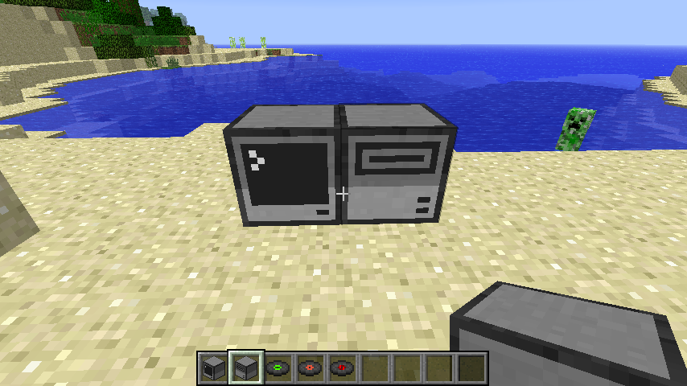
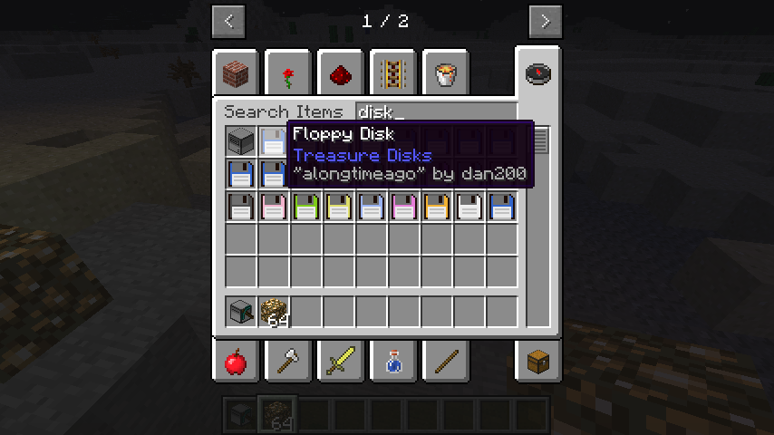

# Section 1: ComputerCraft Basics

## Introduction

> [ComputerCraft](http://www.computercraft.info/) is a modification for Minecraft that’s all about computer programming. It allows you to build in-game Computers and Turtles, and write programs for them using the Lua programming language. The addition of programming to Minecraft opens up a wide variety of new possibilities for automation and creativity. If you’ve never programmed before, it also serves as excellent way to learn a real world skill in a fun, familiar environment.

This will be your first taste of the ComputerCraft mod, and for some of you, your first time using a command line interface. With this knowledge, you can start using other command line software, and you'll get a solid foundation in simple programming skills.

### The Command Line

* Open the ComputerCraft world
* Open your inventory and search for `computer`
* Place a computer on the ground and right-click on it  

When you place a computer and right click on it, the first thing you see is this.


This is a command line. Here, we can type words to run programs, and we can look inside folders just like in a graphical interface. Let's do that now.


* The ```ls``` command lists the contents of the current directory
* The ```cd``` command changes directories, e.g. ```cd rom```  

Up next we'll run the edit program and see what it looks like.
Type `edit test`.


This is the program you use to edit your programs. Looks pretty simple huh? This program is all you need to start writing you own code in ComputerCraft.

### Play text adventure Minecraft inside a ComputerCraft computer
  * Type `adventure`
  * Some of the commands available in the Adventure program:
    * `punch`
    * `take` or `grab`
    * `craft` or `make`
    * `go`
    * `eat`
    * `inventory`

    

    In case you haven't noticed by now, Adventure is really just text-based Minecraft. You're playing Minecraft on a computer inside Minecraft.

### Peripherals

* Open your inventory and search for ```disk drive```
* Place the disk drive next to the computer

  

* Right click the disk drive to open it.
  * Try putting a music disk in the disk drive.
  * Play the music by right clicking your computer and running the `dj` program.

#### Create a monitor

* Open your inventory and search for `monitor`
* Place 12 monitors in a 6 wide by 2 high pattern to create a giant widescreen monitor
* Place a computer next to the monitor
* Place a disk drive next to the computer

#### Watch a movie

* Open your inventory and search for `disk`
* Find a disk labeled `alongtimeago` and place it into the disk drive

  

* Right click on the computer and run the `alongtimeago` program
  * To run a program on the disk, specify the full path to the program like this: `disk/alongtimeago`
  * To run the program on the monitor, specify the monitor first, like this: `monitor [top|bottom|left|right|front|back] disk/alongtimeago`
  * The syntax `[top|bottom|left|right|front|back]` means pick which side your monitor is on and only type that direction, of those six shown. So your command would be something like `monitor left disk/alongtimeago`.


* To quit any running program, hold down ```ctrl + t```

* To restart the computer, hold down ```ctrl + r```

# Turtles

## Intro

Turtles are programmable robots that you can use to collect resources, clear terrain, and other such tasks.  They run an OS called turtleOS and the programs they run can be stored on internal memory or floppy disks.  There are farming, mining, crafting, and melee turtles.  They are categorized based on the Diamond tool* you equip them with.

*Note: Tools equipped to turtles will not wear out and turtles themselves are indestructible (unless you break them yourself).  This makes them one of the safest ways to utilize diamond tools, not to mention the time they will save you.

Like any robot, turtles require fuel.  They can get energy from anything that would work in a furnace as well as other more advanced options we'll get to later.  Different types of fuel will yield different _fuel counts_ which is the number of blocks the turtle can move with that amount of fuel.  For example, coal will give the turtle 80 fuel, so the turtle can now move 80 blocks.

1. Add some dancing turtles
  1. Open your inventory and search for ```turtle```
  1. Place a turtle or two on the ground
  1. Right-click on the turtle
  1. Run the ```dance``` program

## Make it move!

Turtles have several default programs including the "go" program.

1. Select a turtle and put a _coal_ in its inventory.
2. type ```refuel```
  1. Notice it says _Fuel level is 80_
3. type ```go forward 10``` and watch it go!
  1. type ```refuel``` and notice that the fuel level is now 70.
  2. Whenever there is no fuel source in the turtle's inventory, you can type ```refuel``` to check its fuel level.

The "go" program has the following format:
```go <direction> <distance>```

Note: For fast/mass refueling, type ```refuel all```
