# Section 2: Adder and ComputerCraft

## Redstone Adder Circuit

An _adder_ uses logic gates to perform addition. There are three inputs to the whole circuit: A, B, and carry. The carry is the result from the previous addition (think of how you carry a 1 when you add large numbers). The two outputs are the result and the carry for the next addition.

This diagram shows the overall structure of an adder.

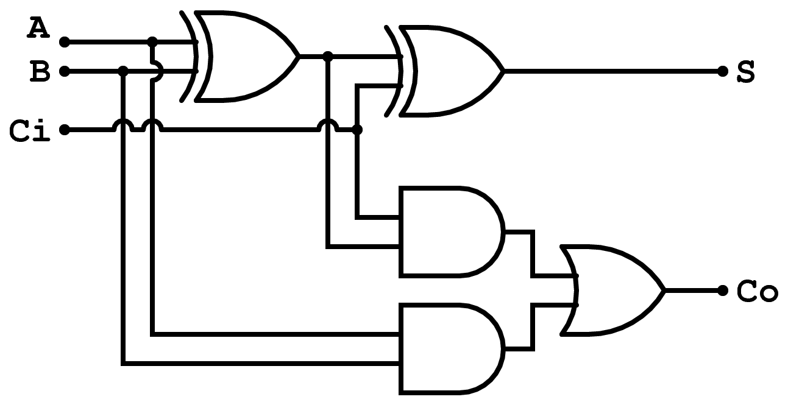

Look at the logic gates key so you can begin to understand how the adder works.

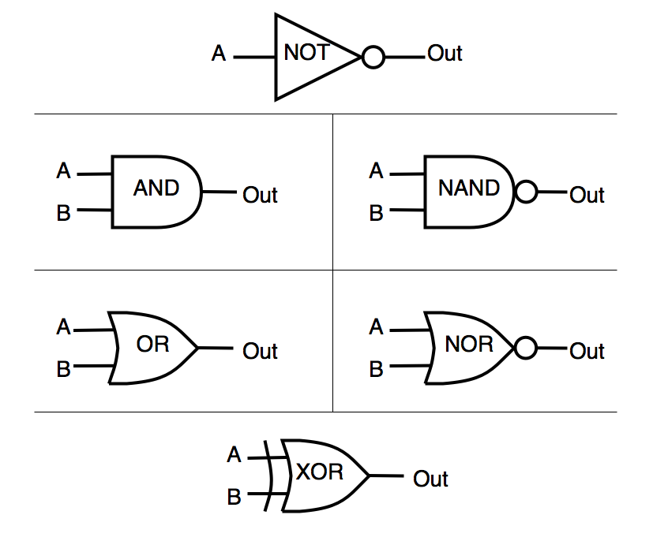

Now, we're going to build an adder using redstone! Follow along with the steps as best you can. This is a complex circuit so be sure to ask questions. The doors at the end represent the output. The door to the left represents the normal output, and the door to the right represents the carry. An open door is a 1 and a closed door is a 0.

There are three inputs, so be sure to put signs to label each one. Levers are best since we can switch them between ON and OFF easily.


Next, build two XOR gates. The first one (on the left; we'll call it XOR gate 1) takes input from A and B. The second one (XOR gate 2) takes input from the output of the first gate and the carry.

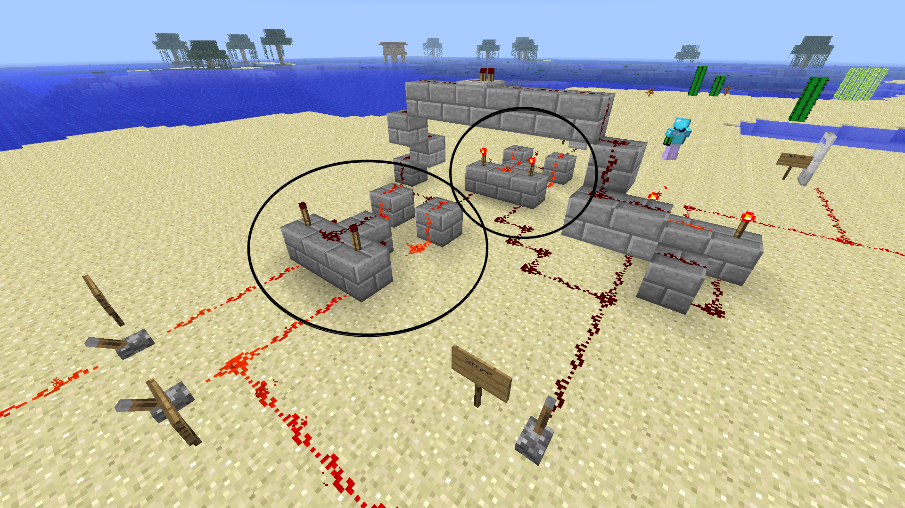

A second perspective of the XOR gates.


This AND gate takes input from the carry and the output of XOR gate 1. The blue circle shows where the gate 1 output goes up and over to this AND.

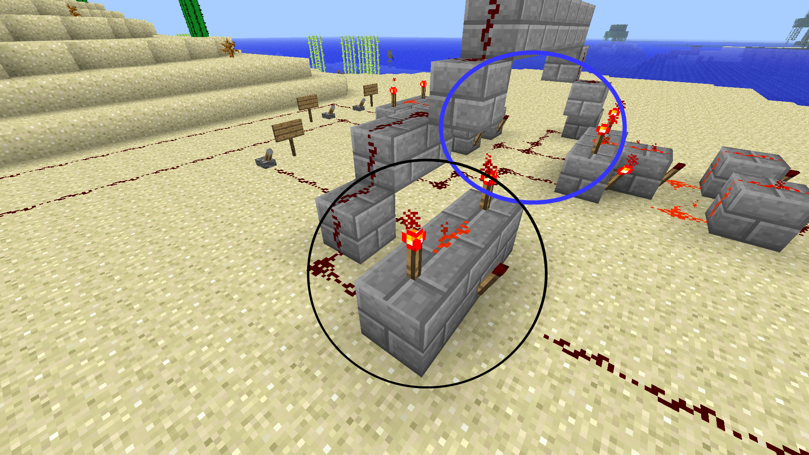

The second AND gate. This one takes input from the original A and B inputs. Notice how it and the output of the other AND gate combine and go to the door representing the carry.

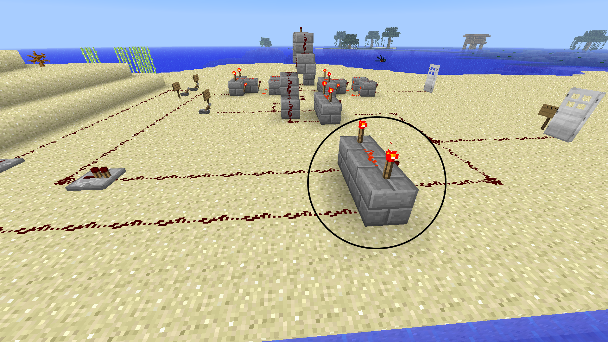

Two overviews of the entire adder from different perspectives.

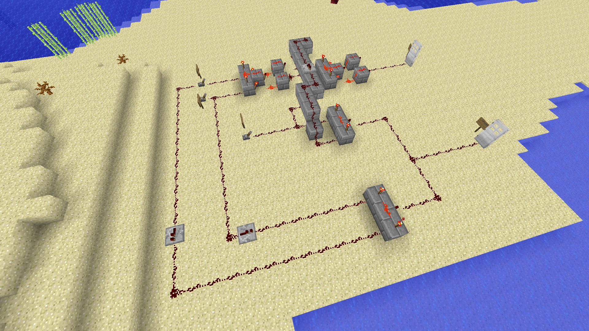  

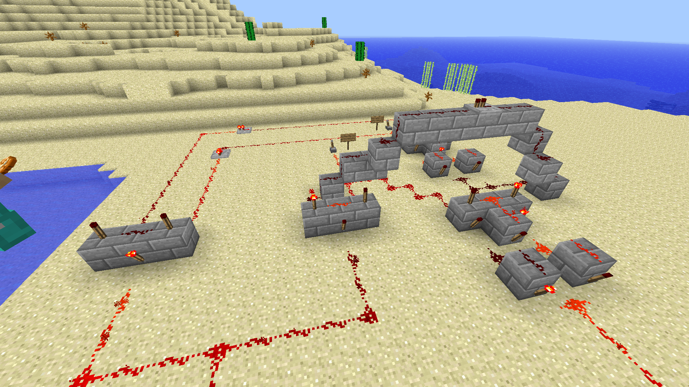

## ComputerCraft Basics

> [ComputerCraft](http://www.computercraft.info/) is a modification for Minecraft that’s all about computer programming. It allows you to build in-game Computers and Turtles, and write programs for them using the Lua programming language. The addition of programming to Minecraft opens up a wide variety of new possibilities for automation and creativity. If you’ve never programmed before, it also serves as excellent way to learn a real world skill in a fun, familiar environment.

This will be your first taste of the ComputerCraft mod, and for some of you, your first time using a command line interface. With this knowledge, you can start using other command line software, and you'll get a solid foundation in simple programming skills.

### The Command Line

When you place a computer and right click on it, the first thing you see is this.

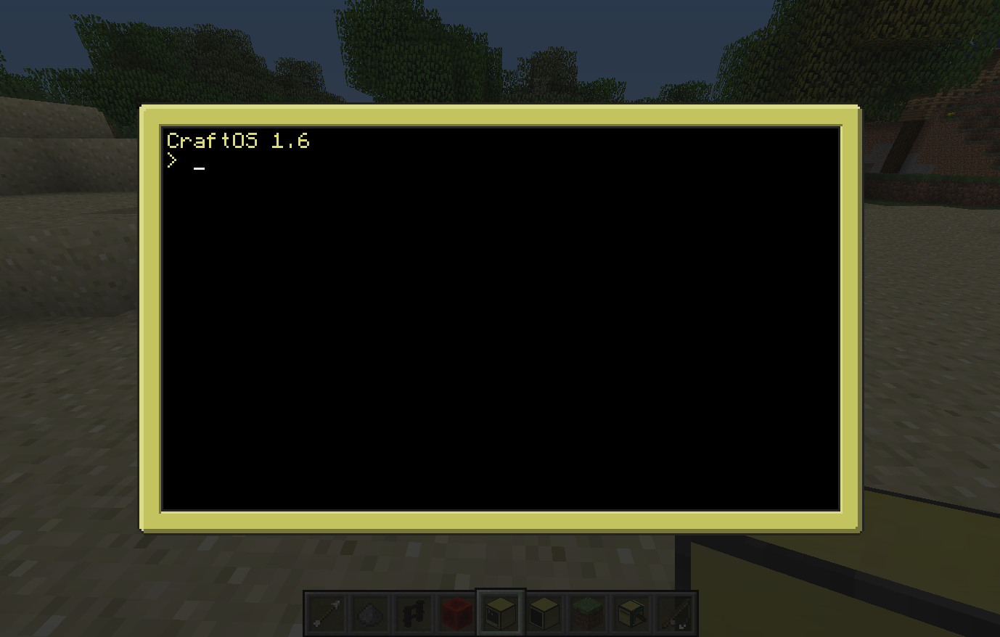

This is a command line. Here, we can type word to run programs, and we can look inside folders just like in a graphical interface. Let's do that now.


Up next we'll run the edit program and see what it look like.


This is the program you would usually use to edit your programs. Looks pretty spartan huh?

Let's download a better one. This program is called luaIDE, and it's a fancy code editor written just for ComputerCraft.

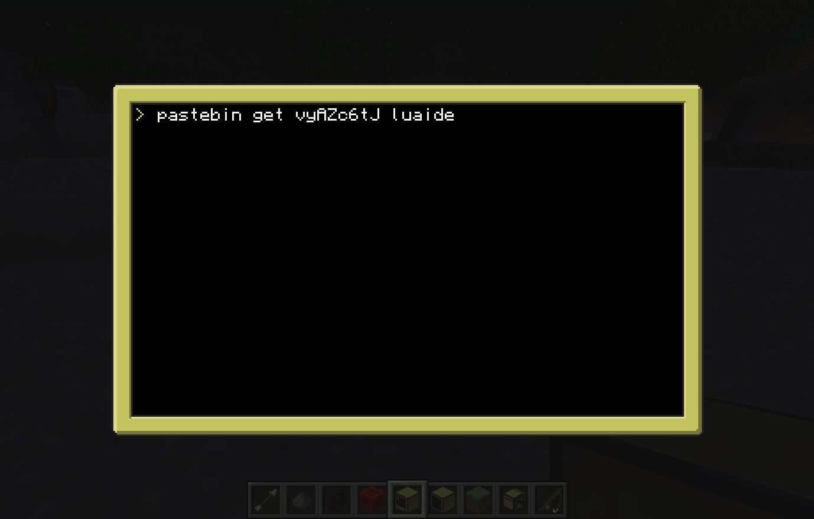

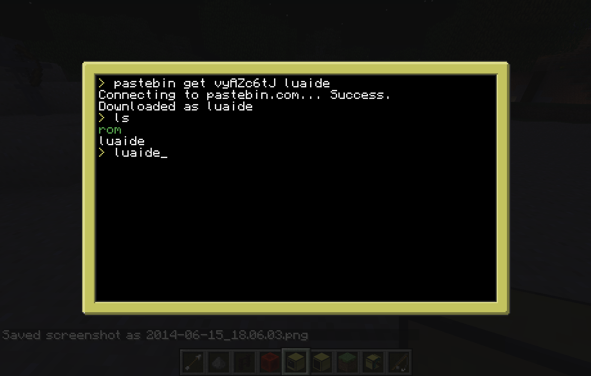


There we go, much better. If you're using an advanced computer, you can click on these buttons, otherwise just use the arrow keys to navigate.

Let's make a new file called ```helloworld```


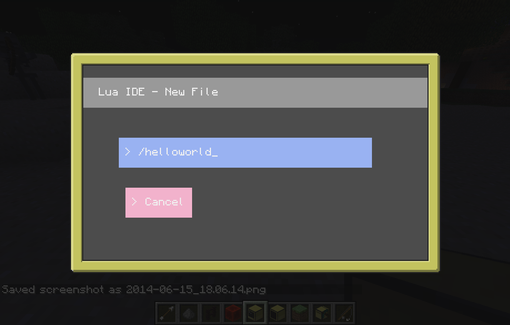

This editor will autocomplete brackets and quotes for you. Watch!

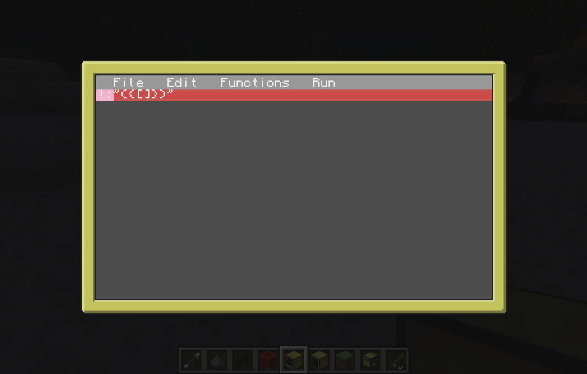

Now let's do some stuff!

### Getting familiar with ComputerCraft

1. Open the ComputerCraft world
1. Open your inventory and search for ```computer```
1. Place a computer on the ground and right-click on it  
 
1. Navigate to programs
 1. the ```ls``` command lists the contents of the current directory
 1. the ```cd``` command changes directories, e.g. ```cd rom```  
 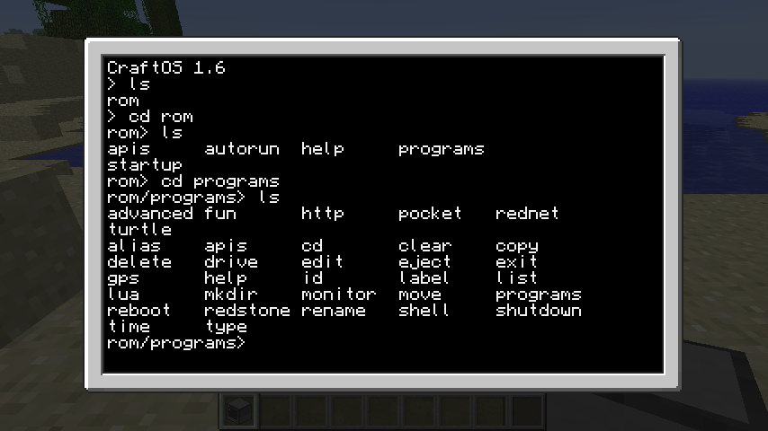
1. Play text adventure Minecraft inside a ComputerCraft computer
  1. type ```adventure```
  1. some of the commands available in the Adventure program:
    1. ```punch```
    1. ```take``` or ```grab```
    1. ```craft``` or ```make```
    1. ```go```
    1. ```eat```
    1. ```inventory```  
    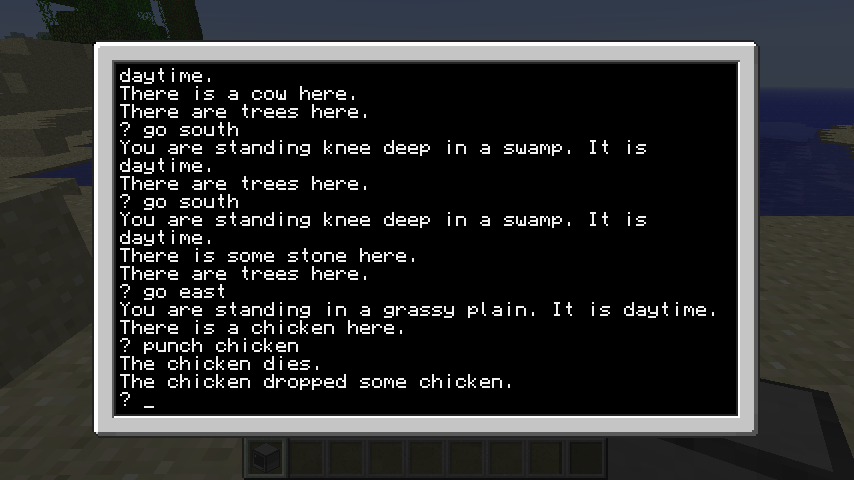  
    In case you haven't noticed by now, Adventure is really just text-based Minecraft. You're playing Minecraft on a computer inside Minecraft.
1. Add disk drive
  1. Open your inventory and search for ```disk drive```
  1. Place the disk drive next to the computer  
  
1. Add a music disk to the disk drive
1. Play the music with the ```dj``` program
1. Create a monitor
  1. Open your inventory and search for ```monitor```
  1. Place 12 monitors in a 6 wide by 2 high pattern to create a giant widescreen monitor
  1. Place a computer next to the monitor
  1. Place a disk drive next to the computer
1. Watch a movie on the monitor
  1. Open your inventory and search for ```disk```
  1. Find a disk labeled ```alongtimeago``` and place it into the disk drive  
    
  1. Right click on the computer and run the ```alongtimeago``` program  
    1. To run a program on the disk, specify the full path to the program like this: ```disk/alongtimeago```  
    1. To run the program on the monitor, specify the monitor first, so this: ```monitor [top|bottom|left|right|front|back] disk/alongtimeago```
      The syntax ```[top|bottom|left|right|front|back]``` means pick which side your monitor is on and only type that direction, of those six shown. So you command would be something like ```monitor left disk/alongtimeago```.
  1. Sit back and enjoy the show  
  
  1. To quit any running program, hold down ```ctrl + r```

Now explore the other programs available on ComputerCraft computers.