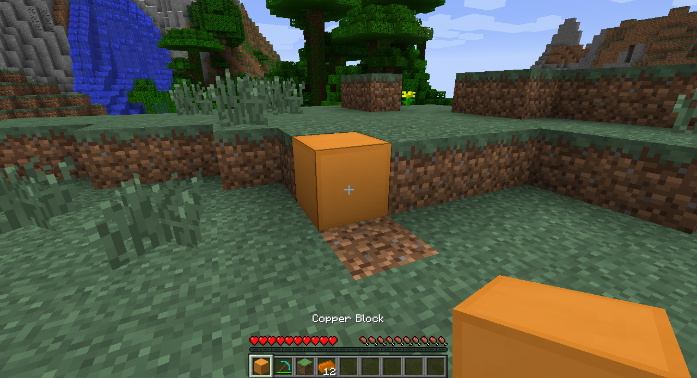

# Making basic items
Making an item is very similar to making a new block, except that we will be extending the `Item` class rather than the `Block` class.

```java
package com.example.coppermod;

import net.minecraft.item.Item;

public class CopperIngot extends Item {

}
```

Just as we did with our `CopperBlock` class, we can also add a constructor and give some properties to our `CopperIngot`.

```java
public CopperIngot()
{
    this.setUnlocalizedName("copper_ingot");
    this.setCreativeTab(CreativeTabs.tabMaterials);
    this.setTextureName("coppermod:copper_ingot");
}
```

One important note regarding textures is that item textures should have transparent backgrounds, or there will be a white square around the item in the game. Transparency backgrounds are indicated by a grey and white checkerboard on the background of the image file.


We'll also need to register our item with the game using the `registerItem` function. You should create a static `copperIngot` variable in `CopperMod` class just as we did with our static `copperBlock` variable.

```java
copperIngot = new CopperIngot();    //initializing the variable you should declare in the class
GameRegistry.registerItem(copperIngot, MODID + "_" + copperBlock.getUnlocalizedName());
```

## On-click effects
There are two methods that are called when the player right-clicks while holding an item. `onItemUse` is called when the player is targeting a block in range (ie. the block has the black wireframe around it), while `onItemRightClick` is called regardless of what the player is targeting (ie. even if they are looking at the sky).

`onItemUse` gives us several parameters that we can use to make _something_ happen when an item is used.

```java
@Override
public boolean onItemUse(ItemStack itemstack, EntityPlayer player, World world, int p_77648_4_, int p_77648_5_, 
int p_77648_6_, int p_77648_7_, float p_77648_8_, float p_77648_9_, float p_77648_10_)
{
    return false;
}
```

```java
`onItemRightClick` is a bit more general and primitive. There are fewer arguments given to us,
  @Override
public ItemStack onItemRightClick(ItemStack itemstack, World world, EntityPlayer player)
{
    return itemstack;
}
```

## Setting names

The names that we've given our new blocks and items so far are all hard-coded into our mod. They are all lowercase and use underscores to separate words, but they don't look like the typical names of items in Minecraft. Also, what if we want people in other countries who speak different languages to play our mod? We can use what are called _language packs_ to give our items language-specific names that will actually show up in the game. The packs also replace the cumbersome "package.item.item"-type names with real names such as "Iron Ingot" or "Dirt".

### File extensions

Before we create our language packs, make sure you have "hide file extensions for known file types" disabled. To check if its disabled, go look at your textures.  If they show up as "_name_.png" you're good.  Otherwise, follow these instructions.  

##### Windows
1. Start -> Control Panel -> Appearance and Personalization -> Folder Options
2. Click on "View" tab
3. Click "Advanced settings"
4. Uncheck the box next to "Hide extensions for known file types" then click "OK"

##### Mac
1. Select Finder -> Preferences -> Advanced
2. Select "Show all filename extensions"

### Making the language pack

1. Create a folder called "lang" in the "assets/examplemod" folder.
1. Create a new text file called "en_US.lang" in the folder.


1. Right-click on the file and choose to edit it. The default entry is something similar to: `category.blockName.name=Item Name`. The name that appeared for our initial block, `tile.copper_block.name` is what we would use in our case. So my line would be `tile.copper_block.name=Copper Block`.

1. Save the file and run Minecraft. Your name should now appear in-game.

