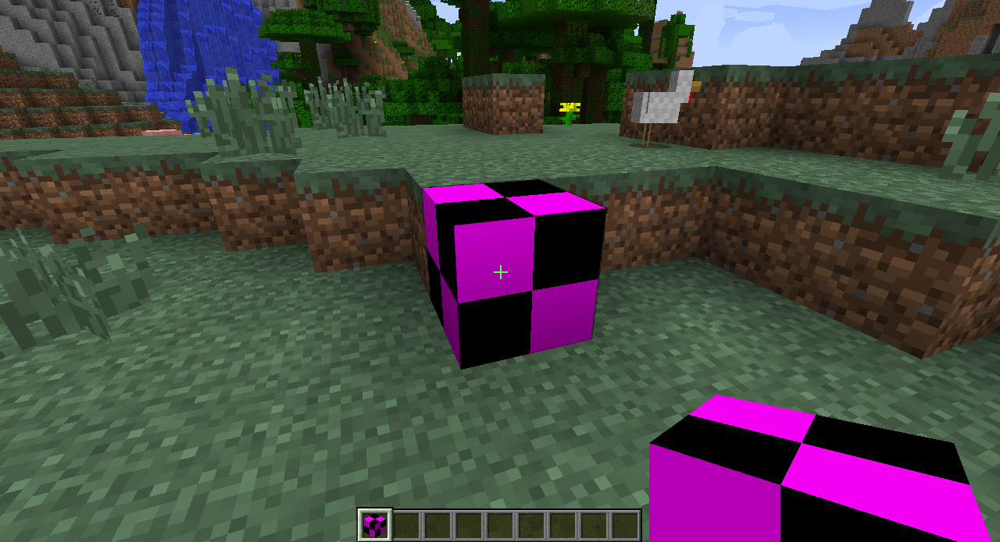
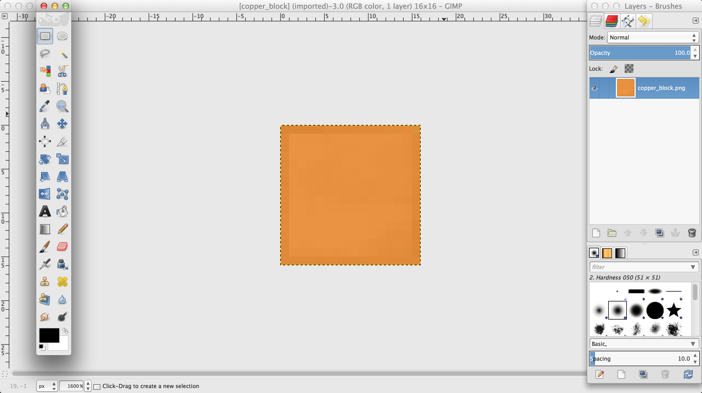
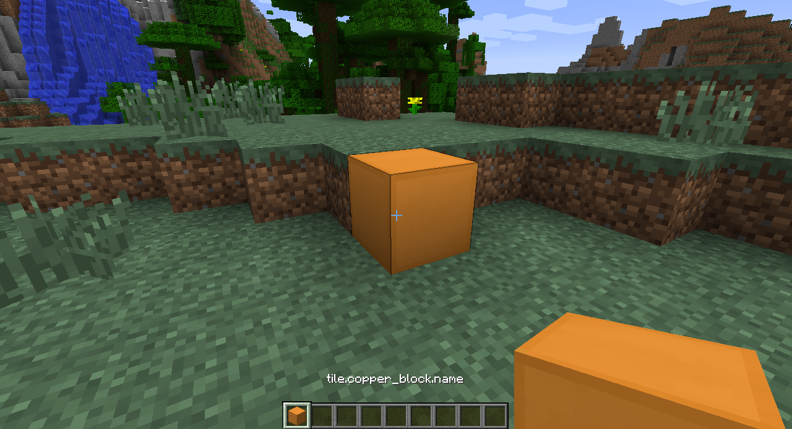
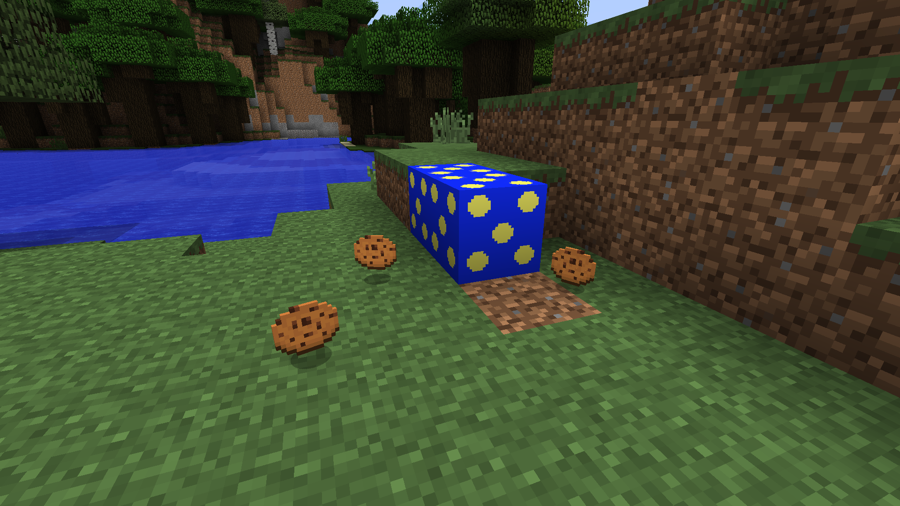

# Mod Dev

## Setup

1. Extract the "forge" folder.
1. Shift + right-click inside the folder and choose "Open command window here". A console window will appear.
1. Type `gradlew setupDecompWorkspace --refresh-dependencies` and press `Enter`. This will download the Minecraft source code and decompile it so we can work with it to make our mods. If any errors occur, the program should give you suggestions on what to fix before trying again.
1. Type `gradlew idea` and press `Enter`, which sets up an IntelliJ workspace for coding.
1. Open IntelliJ and select the created project at the top.

## Creating new blocks

> In this section, be sure to match ALL capitalization and punctuation as exactly as possible.

Programmers use something called a _class_ as a blueprint for all of the objects in Minecraft. There's a class for a diamond pickaxe, for an iron ore, and all other blocks and items. By creating our own class, we can add our own objects to the game. Rather than make a completely new class, however, we can _extend_ the existing Block class and make our own new block. It will have all the normal properties of a block (can be broken, placed down, picked up) but we can set our own texture, hardness, and sound.

Create a new class called "GenericBlock" by right-clicking on the package and choosing "Create new class". Name it "GenericBlock" and press OK. The following code should be displayed. You should add the lines with comments after them.

```java
package com.example.examplemod;

import net.minecraft.block.Block; //Add me

/**
 * Created by atvaccaro on 6/21/2014.
 */
public class GenericBlock extends Block //Add the second half of this line
{
}
```

An error will come up regarding a missing _constructor_. Constructors are a set of functions that run whenever a new block is created in the game. The following constructor should go inside the braces of the GenericBlock class. If your cursor is over `GenericBlock`, you should be able to press Alt-Enter and select "Add missing constructor".

```java
protected GenericBlock(Material p_i45394_1_)
{
    super(p_i45394_1_);

    setHardness(0.5F);
    setStepSound(Block.soundTypeGravel);
    setBlockName("genericDirt");
    setCreativeTab(CreativeTabs.tabBlock);
    setBlockTextureName("examplemod:genericDirt");
    setHarvestLevel("shovel", 0); //0 is wood
}
```

Taking a look at our method calls, it will be made of the "ground" material, sound like gravel, can be broken more easily by shovels, and be called "genericDirt" among other properties.

However, simply making a new class is not enough. To actually add our block into the game, we need to register it with Minecraft Forge. The following block of code goes into the ExampleMod.java class, which you can open from the project tree on the left side of the screen.

```java
@EventHandler
public void preInit(FMLPreInitializationEvent event)
{
  Block genericDirt = new GenericBlock(Material.ground).
  GameRegistry.registerBlock(genericDirt, "genericDirt");
}
```

This block of code registers our newly-created block with the game.

So to recap, the ExampleMod.java and GenericBlock.java files should look as follows.

```java
// ExampleMod.java
package com.example.examplemod;

import cpw.mods.fml.common.registry.GameRegistry;
import net.minecraft.block.Block;
import net.minecraft.block.material.Material;
import net.minecraft.creativetab.CreativeTabs;
import net.minecraft.init.Blocks;
import cpw.mods.fml.common.Mod;
import cpw.mods.fml.common.Mod.EventHandler;
import cpw.mods.fml.common.event.FMLPreInitializationEvent;
import cpw.mods.fml.common.event.FMLInitializationEvent;
import net.minecraftforge.common.MinecraftForge;

@Mod(modid = ExampleMod.MODID, version = ExampleMod.VERSION)
public class ExampleMod
{
    public static final String MODID = "examplemod";
    public static final String VERSION = "1.0";

    @EventHandler
    public void preInit(FMLPreInitializationEvent event)
    {
        Block genericDirt = new GenericBlock(Material.ground);
        GameRegistry.registerBlock(genericDirt, "genericDirt");
    }

    @EventHandler
    public void init(FMLInitializationEvent event)
    {
		// some example code
        System.out.println("DIRT BLOCK >> "+Blocks.dirt.getUnlocalizedName());
    }
}
```

```java
package com.example.examplemod;

import net.minecraft.block.Block;
import net.minecraft.block.material.Material;

/**
 * Created by atvaccaro on 6/21/2014.
 */
public class GenericBlock extends Block
{
    protected GenericBlock(Material p_i45394_1_) {
        super(p_i45394_1_);

        setHardness(0.5F);
        setStepSound(Block.soundTypeGravel);
        setBlockName("genericDirt");
        setCreativeTab(CreativeTabs.tabBlock);
        setBlockTextureName("examplemod:genericDirt");
        setHarvestLevel("shovel", 0); //0 is wood
    }
}
```

To actually launch our modded Minecraft, run the project by clicking on the green arrow at the top of the IDE. Make a new creative world and try placing your block on the ground. It should be under the normal "blocks" tab at the very bottom and will be called _tile.genericBlock.name_. The coloring should be a purple and black checkerboard, the default color scheme when a texture is not specified.



## Adding textures to blocks

1. First, create the folder that will hold our textures. The full path is "src/main/resources/assets/examplemod/textures/blocks". Start at the "resources" folder (it should already exist) and create one folder after another until you get down to the final one, "blocks".
1. Open up Paint and create a new empty canvas. The resolution should be square; most Minecraft textures are 16x16 but you could also try 32x32 or 64x64.
1. Take a few minutes and make your own texture! For right now, the block will have the same texture on all six sides like cobblestone or obsidian. Save the texture as .png called "genericDirt" in the "blocks" folder. I made a dice-like yellow and blue texture for mine.
  
1. After your texture has been saved, run Minecraft. Now check out the texture of your block!
  

## Multi-sided Textures

What about blocks like grass that have different textures on different sides? The following code in the GenericBlock class registers several different textures and tells the program which textures belong on which side.

```java
//Creating our icon variables
private IIcon topIcon;
private IIcon sideIcon;
private IIcon botIcon;

//Registering specific textures with each icon variable
@Override
public void registerBlockIcons(IIconRegister par1IconRegister)
{
    this.topIcon = par1IconRegister.registerIcon("examplemod:genericDirtTop");
    this.sideIcon = par1IconRegister.registerIcon("examplemod:genericDirt");
    this.botIcon = par1IconRegister.registerIcon("examplemod:genericDirtBot");
}

//This function tells which icons to use for which sides of the block
@Override
public IIcon getIcon(int par1, int par2) //par1 = the side of the block
{
    if (par1 == 0) //Bottom
        return botIcon;

    else if (par1 == 1) //Top
        return topIcon;

    else //all other sides
        return sideIcon;
}
```


## Specifying dropped items

Right now, our custom block drops itself just as dirt and wood does. But what about glowstone? It drops an item (or items) when broken. We can modify our existing block easily to drop an item as well. The following function declaration goes into our GenericBlock class.

```java
@Override
public Item getItemDropped(int metadata, Random random, int fortune)
{
    return Item.getItemById(357); //What item has an ID of 357?
}
```


