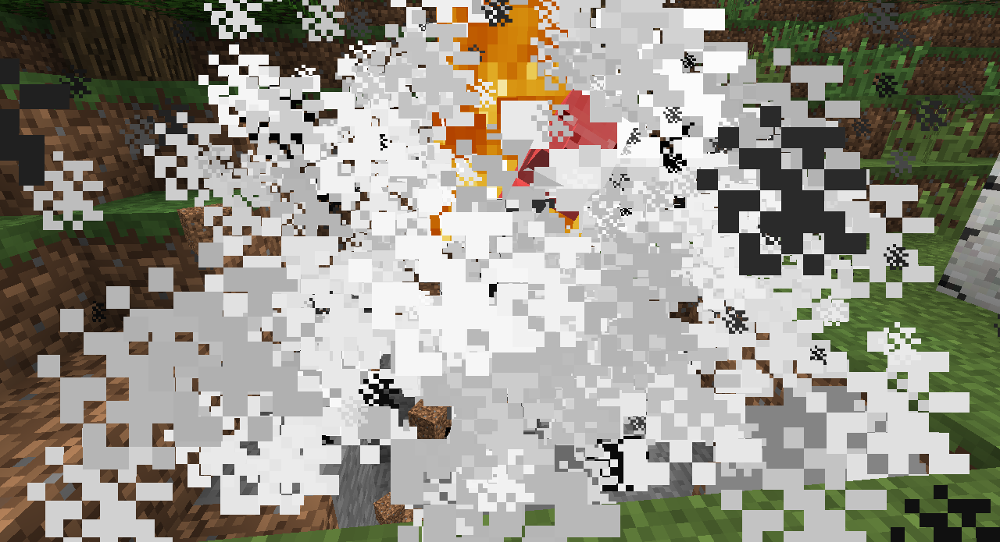

# Advanced textures and tools
>In this section, you'll learn how to give blocks multiple textures, create new tool materials, and add on-hit effects to tools.

## Multi-sided textures

What about blocks like grass that have different textures on different sides? The following code in the `CopperBlock` class registers three different textures and tells the program which textures belong on the top, sides, and bottom. If we want, we could even make the side textures different (like a furnace or dispenser). You will have to create three texture files matching the names that are being registered. I've made it so that my block has a silver-colored top and bottom.

```java
//Creating our icon variables
private IIcon topIcon;
private IIcon sideIcon;
private IIcon botIcon;

//This function registers our textures to their specific icons
@Override
public void registerBlockIcons(IIconRegister ir)
{
    this.topIcon = ir.registerIcon("coppermod:copper_block_top");
    this.sideIcon = ir.registerIcon("coppermod:copper_block_side");
    this.botIcon = ir.registerIcon("coppermod:copper_block_bottom");
}

//This function tells which icons to use for which sides of the block
@Override
public IIcon getIcon(int side, int par2) //side = the side of the block
{
    if (side == 0) //Bottom
        return botIcon;

    else if (side == 1) //Top
        return topIcon;

    else //all other sides, numbers 2,3,4,5
        return sideIcon;
}
```


## Changing tool properties
Items in Minecraft have a variety of properties that determine how they behave in-game. These include `EntityDamage`, `Enchantability`, and `Durability`. We can make our own tools (from copper, of course!) and give them their own, unique properties that set them apart from other tools.

### Custom ToolMaterial
The easiest way to manipulate these parameters is to simply create our custom item from a custom `ToolMaterial`. A `ToolMaterial` is a variable that holds all of the information about a material that can be made into tools. Minecraft already has them for materials such as wood and iron, but we need to make one for copper. We use the `EnumHelper` class to actually create our new material variable (this variable declaration goes in our main mod class).

```java
public static final Item.ToolMaterial COPPER = EnumHelper.addToolMaterial("copper_tool", 2,
            150, 5.0F, 7.0F, 21); //Harvest level, durability, block damage, entity damage, enchantability
```
Note that the `addToolMaterial` method takes a total of six arguments. The first argument is a string that will be registered as the name of our material. The other five arguments are numbers that determine attributes of the material:  
  * Harvest level (0-3): Determines what types of blocks the tools can break properly.  
  * Durability (Diamond = 1562): The number of uses before the tool breaks.  
  * Block and Entity damages: Determine how much damage the tool material does to blocks and entities, respectively (these arguments are floats).  
  * Enchantability (Gold Armor = 25): How well a tool can be enchanted (higher number means better enchantments at lower levels).  

Since we've made `COPPER` a static variable, we can later refer to it as `CopperMod.COPPER` for registering our tools with the game. Generally, `final` variables are in all-caps, therefore we call our `final` variable `COPPER`.


### Custom tool effects
By knowing how to override the `hitEntity` function, we can create fire, lightning bolts, and even explosions when our tools are used!

Create the following function definition in one of your item classes.
```java
public boolean hitEntity(ItemStack itemHitting, EntityLivingBase entityBeingHit, EntityLivingBase entityHitting)
{

}
```

This function is called whenever the item is used to hit an entity, whether it's a zombie or a spider or even a cow. The `entityBeingHit` variable points to the `Entity` object being hit in the game, and it is the variable that we can use to give effects to our item. For example, we can set the entity on fire when hit.

```java
entityBeingHit.setFire(4);  //what do you think the integer does?
```


We can even create an explosion at the hit entity's location!
```java
entityBeingHit.worldObj.createExplosion(null, entityBeingHit.posX, entityBeingHit.posY, entityBeingHit.posZ, 3.0f, true);  //the float determines the radius of the explosion
```



