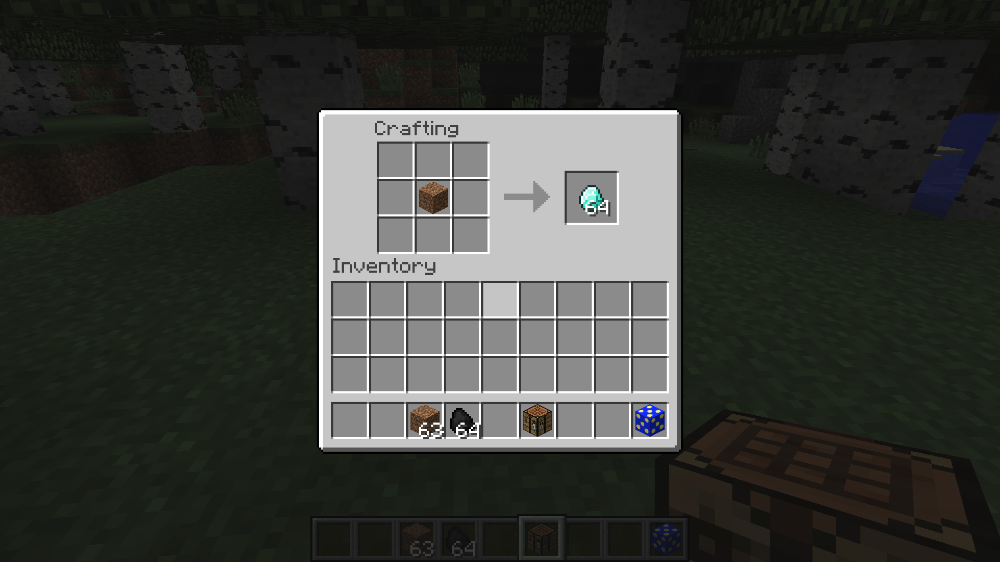
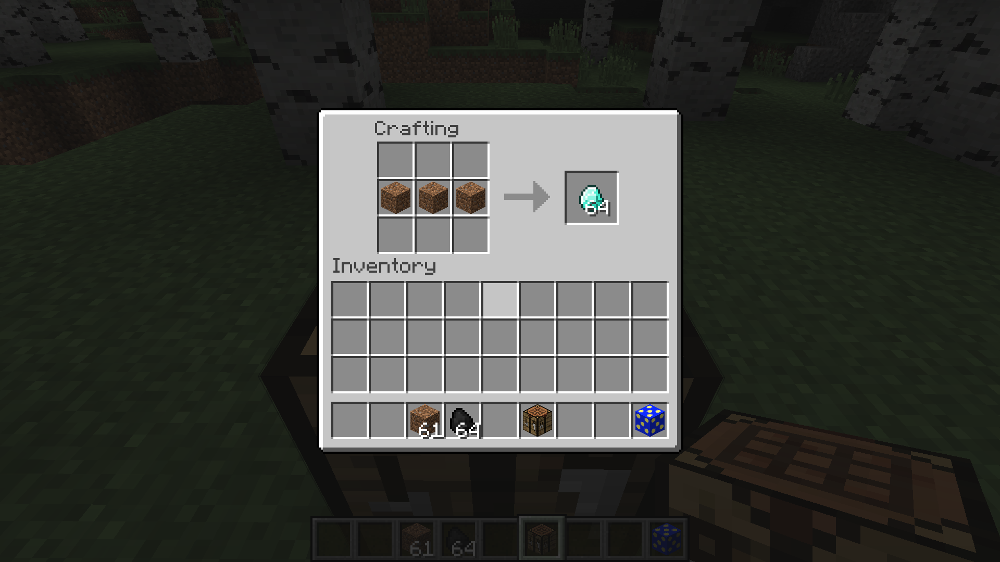

# More mod development
>In this section, you'll learn how to make new items, specify what a block drops when broken, and make new crafting/smelting recipes.

## Making new items
Making an item is very similar to making a new block, except that we will be extending the `Item` class rather than the `Block` class.

```java
package com.example.coppermod;

import net.minecraft.item.Item;

public class CopperIngot extends Item {

}
```

Just as we did with our `CopperBlock` class, we can also add a constructor and give some properties to our `CopperIngot`.

```java
public CopperIngot()
{
    this.setUnlocalizedName("copper_ingot");
    this.setCreativeTab(CreativeTabs.tabMaterials);
    this.setTextureName("coppermod:copper_ingot");
}
```

One important note regarding textures is that item textures should have transparent backgrounds, or there will be a white square around the item in the game. Transparency backgrounds are indicated by a grey and white checkerboard on the background of the image file.

<!-- TO DO: Add item texture screenshot here -->

We'll also need to register our item with the game using the `registerItem` function. You should create a static `copperIngot` variable in `CopperMod` class just as we did with our static `copperBlock` variable.

```java
copperIngot = new CopperIngot();    //initializing the variable you should declare in the class
GameRegistry.registerItem(copperIngot, MODID + "_" + copperBlock.getUnlocalizedName());
```

## Specifying dropped items

Right now, our `CopperBlock` only drops itself when broken, like wood does. But what about blocks suchas glowstone? Glowstone drops an item (specifically glowstone dust) when broken. We can modify our existing block easily to drop an item (or multiple items) when broken. Add the following function declaration to the `CopperBlock` class. Launch the game, and try breaking your block. Our copper block will now drop an ingot when mined.

```java
@Override
public Item getItemDropped(int metadata, Random random, int fortune)
{
    return CopperMod.copperIngot;   //this is why we use static variables
}
```


What if we wanted to make our block drop several ingots when broken? It generally takes 9 ingots to make a block, so let's use the `quantityDropped` method to tell our `CopperBlock` to drop 9 ingots when it is mined. The following method declaration should go in your `CopperBlock` class.

```java
public int quantityDropped(Random rand)
{
    return 9;
}
```


`rand` is a `Random` object that we could use to add randomness to our drops. For example, we could specify that we want a random number of ingots between 2 and 5 to drop when a block is broken by using the `nextInt` method to get a random number.
```java
public int quantityDropped(Random rand)
{
    return 2 + rand.nextInt(3); //random between 2 and 5
}
```

## Making new crafting recipes
>The function calls that create new recipes will go in your main mod class

Now we need to make our new blocks and items useful by creating some recipes! There are two types of recipes we can create: shapeless and shaped. Shapeless recipes (such as making wooden planks from wood) don't require the items to be in any specific orientation to work. Shaped recipes (such as making a pickaxe or shovel) require blocks to be in specific locations for the recipe to function.

We simply use the `addShaplessRecipe` and `addShapedRecipe` function calls to register our recipes with the game. The calls will go in your main mod class, and you will need to import the `ItemStack` and `Items` classes to use them (IntelliJ will prompt you for them when you use them).

### Shapeless recipes

First, let's make a shapeless recipe.
```java
GameRegistry.addShapelessRecipe(new ItemStack(Items.diamond, 64), new ItemStack(Blocks.dirt));
```

This recipe simply trades in a stack of 64 dirt blocks for 64 diamonds. The resulting item is the first argument in the function call, and any input items are the following arguments.



To add more items, simply add more ItemStacks within the parentheses.

```java
GameRegistry.addShapelessRecipe(new ItemStack(Items.diamond, 64), new ItemStack(Blocks.dirt),
    new ItemStack(Blocks.dirt), new ItemStack(Blocks.dirt));
```



### Shaped recipes

Next, let's make a shaped recipe. Shaped recipes group the rows of items using letters to represent the type of block. For example, the recipe for TNT would be: `("xyx", "yxy", "xyx", 'x', new ItemStack(Materials.sulphur), 'y', new ItemStack(Blocks.sand))` Pay attention to the double-quotes for the letters representing the recipe shape and the single-quotes for the letters representing the items in the recipe.

> Note: when we leave out the size of the ItemStack, the game will assume a size of 1.

An example of a shaped recipe. You use three strings to represent the three rows of the crafting table and define which letters relate to which type of item. Spaces are used to represent empty crafting slots.

```java
GameRegistry.addShapedRecipe(new ItemStack(Items.diamond), "xxx", "x x", "xxx", 'x',
    new ItemStack(Items.coal));
```


## Smelting recipes

Smelting recipes are very similar and only require a slightly different function call.

```java
GameRegistry.addSmelting(Blocks.stone, new ItemStack(Blocks.stonebrick), 0.1f);
```

This time, the input item is on the left while the output is on the right. The number at the end specifies how much experience the player receives from the smelting.


On a side note, the _damage values_ of items often hold extra information (also called data) about the block. For example, all the colors of wool are actually the same type of block. They're rendered differently based on the value of their damage value. We can use this data value in our recipes to alter what kinds of wool, clay, or wood are required.

```java
// What do you think this smelting recipe does?
ItemStack woolStackBlack = new ItemStack(Blocks.wool);
ItemStack woolStackOrange = new ItemStack(Blocks.wool);
woolStackBlack.setItemDamage(15);
woolStackOrange.setItemDamage(1);
GameRegistry.addSmelting(woolStackBlack, woolStackOrange, 0.1f);
```


## Setting names

The names that we've given our new blocks and items so far are all hard-coded into our mod. They are all lowercase and use underscores to separate words, but they don't look like the typical names of items in Minecraft. Also, what if we want people in other countries who speak different languages to play our mod? We can use what are called _language packs_ to give our items language-specific names that will actually show up in the game. The packs also replace the cumbersome "package.item.item"-type names with real names such as "Iron Ingot" or "Dirt".

### File extensions

Before we create our language packs, make sure you have "hide file extensions for known file types" disabled. To check if its disabled, go look at your textures.  If they show up as "_name_.png" you're good.  Otherwise, follow these instructions.  

##### Windows
1. Start -> Control Panel -> Appearance and Personalization -> Folder Options
2. Click on "View" tab
3. Click "Advanced settings"
4. Uncheck the box next to "Hide extensions for known file types" then click "OK"

##### Mac
1. Select Finder -> Preferences -> Advanced
2. Select "Show all filename extensions"

### Making the language pack

1. Create a folder called "lang" in the "assets/examplemod" folder.
1. Create a new text file called "en_US.lang" in the folder.


1. Right-click on the file and choose to edit it. The default entry is something similar to: `category.blockName.name=Item Name`. The name that appeared for our initial block, `tile.copper_block.name` is what we would use in our case. So my line would be `tile.copper_block.name=Copper Block`.

1. Save the file and run Minecraft. Your name should now appear in-game.

