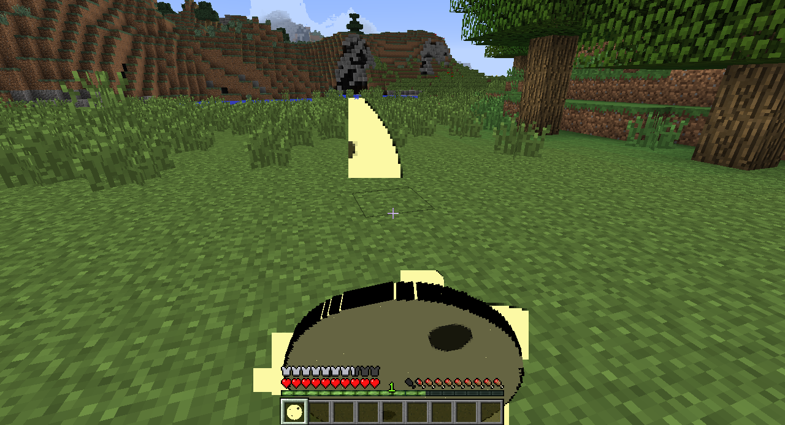

## New foods
>In this section, you will learn how to create new foods and add potion effects to them

Any Minecraft player who wants to survive will need to learn about food and food resources. The foods in vanilla Minecraft tend to be straight-forward. You might cook raw beef into steak, or make cookies from cocoa and wheat. Creating your own food classes will let you create more complicated foods and even add potion effects when you eat something!

The `ItemFood` class is the parent class for all of the food items in Minecraft. Anything descended from `ItemFood` can be eaten and has some hunger or saturation values (the saturation value determines how long you can move until hunger starts ticking down again). For example, I wrote an `ItemSteakTaco` class to add tacos. I extended the `ItemFood` class and created a constructor that calls the superclass constructor.
```java
package com.example.coppermod;

import net.minecraft.item.ItemFood;

public class ItemSteakTaco extends ItemFood {
    public ItemSteakTaco(int foodvalue, float satmodifier, boolean isWolfsFavoriteMeat) {
        super(foodvalue, satmodifier, isWolfsFavoriteMeat);
    }
}
```
The `foodvalue` variable determines how much health is restored when the food is eaten, and the `satmodifier` variable determines how long until the player becomes hungry again. To give an idea of these values, `foodvalue` is set to 8 and `satmodifier` is set to 0.8 for cooked porkchops. The boolean `isWolfsFavoriteMeat` simply tells whether or not the food is appealing to wolves (only true for some meats by default). After writing the class and creating my texture, I register the new item with the game (simultaneously giving the heal and saturation values).


Tacos don't just appear in the wild, however. We also need to create the ingredients as well as recipes in order to make them. For this example, I will make an `ItemTortilla` class and then create the recipes necessary to make the tortilla and then the taco. `ItemTortilla` is also a food, but will not have as good healing and saturation properties.
```java
package com.example.coppermod.item;

import net.minecraft.creativetab.CreativeTabs;
import net.minecraft.item.ItemFood;

public class ItemTortilla extends ItemFood {
    public ItemTortilla(int foodvalue, float satmodifier, boolean isWolfsFavoriteMeat) {
        super(foodvalue, satmodifier, isWolfsFavoriteMeat);

        this.setCreativeTab(CreativeTabs.tabFood);
        this.setUnlocalizedName("itemTortilla");
        this.setTextureName(("coppermod:tortilla"));
    }
}
```


Making the crafting recipe for a food is just like for any other item.
```java
GameRegistry.addShapelessRecipe(new ItemStack(itemSteakTaco), itemTortilla, Items.cooked_beef);
```


Finally, we can quickly and easily add potion effects when our foods are eaten. If we override the `onFoodEaten` method and call the `setPotionEffect` method, we can give the player any potion effect for any duration. Look at the source code of the `Potion` class to know which ID numbers correspond to which potions.
```java
protected void onFoodEaten(ItemStack itemstack, World world, EntityPlayer player)
{
    player.addPotionEffect(new PotionEffect(1, 20, 1));  //potion id, duration, amplifier
}
```

Now that you know the basics of creating foods, pick a couple of fairly complicated foods that require multiple steps and ingredients to make in real life. Some suggestions could be apple pie or a sandwich. Then, recreate the steps in Minecraft! Make new classes that extend `ItemFood` to make the ingredients and recipes (both crafting and smelting!) to simulate the cooking process.
